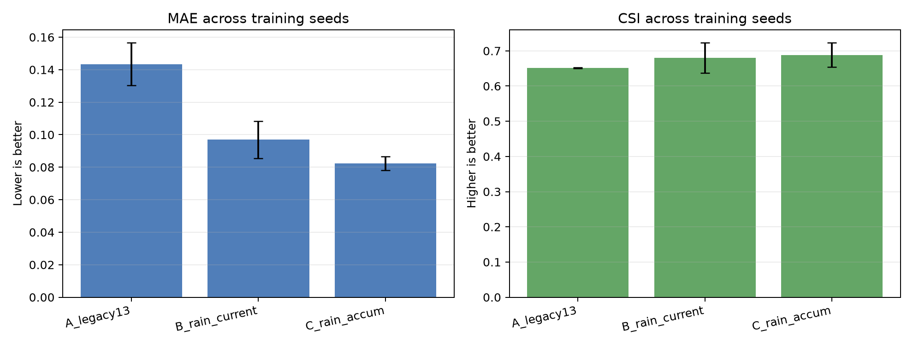
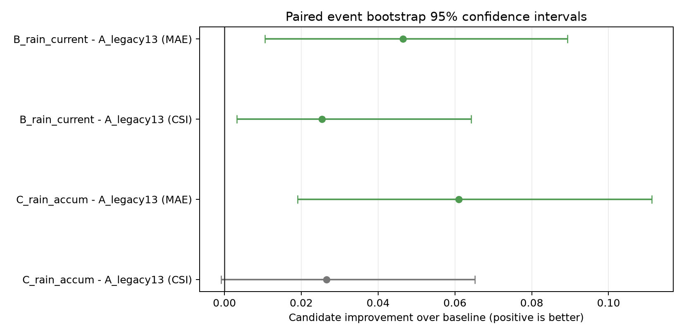
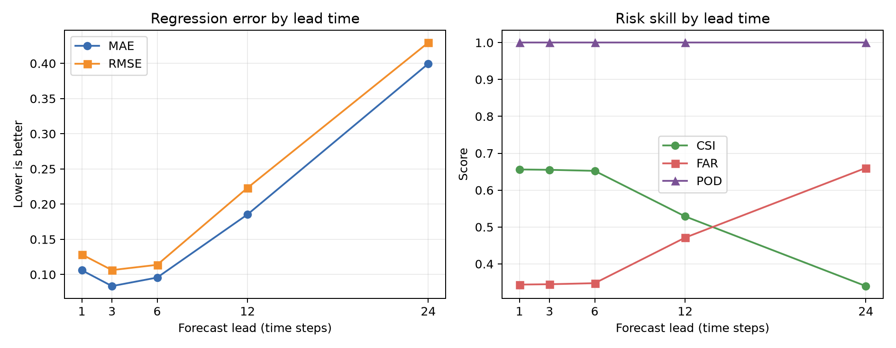
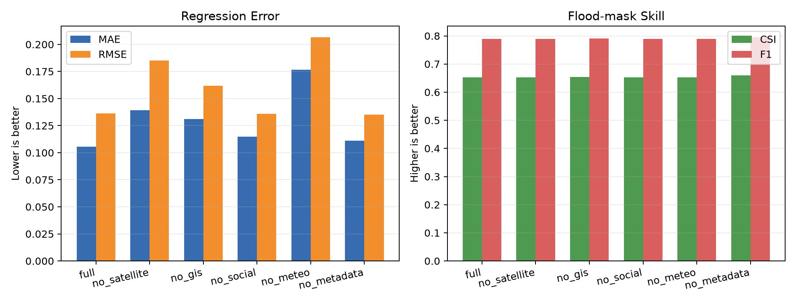

# Batch 3 Reproducible Experiment System

Batch 3 adds experiment infrastructure without changing or replacing the
preserved Conv-LSTM checkpoint. Generated checkpoints remain under ignored
`runs/`; lightweight tables, split manifests, and figures are curated under
`docs/`.

## Event-level split and test policy

- Split unit: complete synthetic flood event, never sliding windows.
- Shared split seed: `44`.
- Test events: `event_0014`, `event_0006`, and `event_0007` in the controlled
  20-event dataset.
- Risk threshold: pre-registered `0.28 normalized_depth` for the reported test
  comparisons.
- Split evidence: `docs/experiments/split_seed_44.json`.
- Statistical differences use paired event results. Positive improvement means
  the candidate is better for both lower-is-better and higher-is-better metrics.

## Three-seed rainfall comparison

Seeds `42`, `44`, and `52` use the same event split, three-epoch budget,
Conv-LSTM hidden size `12`, and risk threshold. Seed `44` is the preserved Batch
2 controlled run; the other seeds were trained with the identical settings.

| Variant | MAE mean +/- std | RMSE mean +/- std | CSI mean +/- std | FAR mean +/- std |
|---|---:|---:|---:|---:|
| A: legacy 13 | 0.1434 +/- 0.0132 | 0.1688 +/- 0.0149 | 0.6515 +/- 0.0013 | 0.3310 +/- 0.0290 |
| B: + current rain | 0.0969 +/- 0.0115 | 0.1218 +/- 0.0191 | 0.6799 +/- 0.0427 | 0.3177 +/- 0.0468 |
| C: + current and accumulated rain | **0.0824 +/- 0.0042** | **0.1013 +/- 0.0034** | **0.6885 +/- 0.0345** | **0.2898 +/- 0.0655** |



Across the three held-out events, C improves MAE over A by `0.0610` on average;
the paired bootstrap 95% CI is `[0.0191, 0.1112]`. Its mean CSI improvement is
`0.0266`, but the 95% CI `[-0.0009, 0.0652]` crosses zero. The regression gain is
therefore the firmer result; the CSI gain needs more events and seeds.



## Forecast lead-time diagnostic

The following single-seed, two-epoch diagnostic uses the 17-channel
legacy-plus-accumulated-rain input and a common `0.28` test threshold.

| Lead | Test samples | MAE | RMSE | CSI | FAR | POD |
|---:|---:|---:|---:|---:|---:|---:|
| 1 | 72 | 0.1061 | 0.1284 | 0.6560 | 0.3440 | 1.0000 |
| 3 | 66 | 0.0835 | 0.1063 | 0.6551 | 0.3449 | 1.0000 |
| 6 | 57 | 0.0957 | 0.1138 | 0.6523 | 0.3477 | 1.0000 |
| 12 | 39 | 0.1854 | 0.2232 | 0.5288 | 0.4712 | 1.0000 |
| 24 | 3 | 0.3996 | 0.4296 | 0.3398 | 0.6602 | 1.0000 |



Lead `24` has only one valid window per test event and is included as a stress
test, not a stable estimate. A longer synthetic sequence is required for a
formal long-horizon benchmark.

## Modality-ablation smoke test



The one-epoch modality run validates six channel configurations and their
per-event reporting. Removing meteorology produced the largest MAE degradation
in this run (`0.1054` to `0.1766`), while the metadata-free variant did not
degrade at this small budget. These are smoke-test observations, not modality
importance claims; formal conclusions require the multi-seed budget.

## Reproduce

```bash
python -m src.run_multiseed --fused_dir data/fused --seeds 42,44,52,77,2026 --split_seed 44
python -m src.run_lead_time --fused_dir data/fused --lead_times 1,3,6,12,24 --evaluation_threshold 0.28
python -m src.compare_baselines --fused_dir data/fused --checkpoint outputs/checkpoints/best.pt --thresholds 0.28
```

The default five-seed command is the planned formal run. The committed result
snapshot currently contains three seeds and is labeled accordingly.
