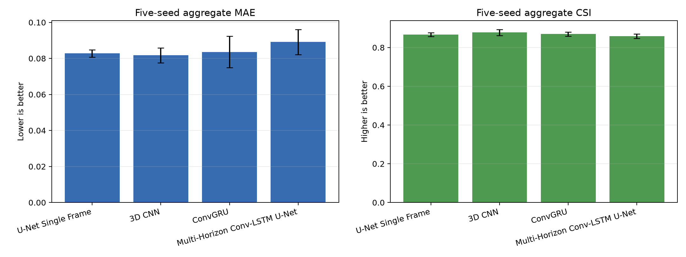
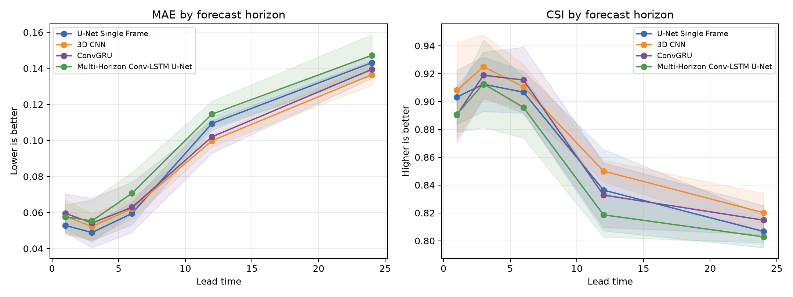
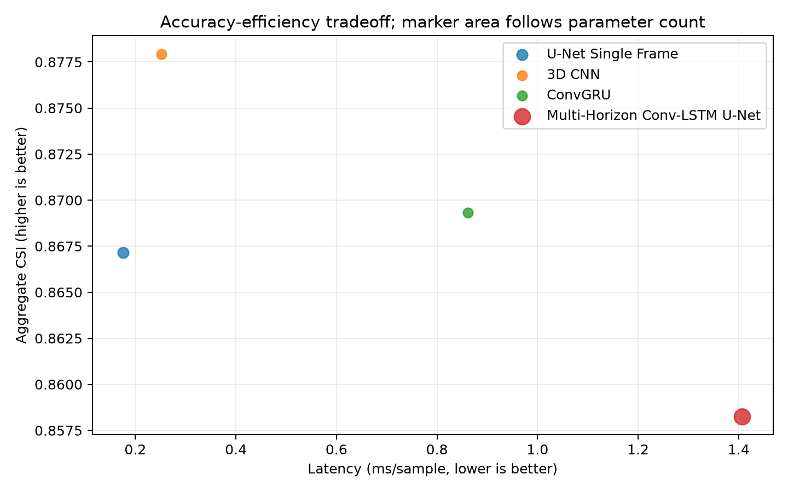

# Batch 4: Multi-Horizon Architecture Benchmark

Batch 4 extends the project from single-target diagnostics to one controlled
multi-horizon benchmark. It adds longer events, five training seeds, three
strong baselines, and a multi-horizon Conv-LSTM U-Net while preserving every
historical Conv-LSTM checkpoint and result.

## Scope

The four compared models receive the same 23-channel fused input tensor and
predict depth maps at leads `1/3/6/12/24` in one forward pass:

| Model | Temporal input | Main role |
|---|---|---|
| U-Net Single Frame | Final input frame only | Strong spatial shortcut baseline |
| 3D CNN | Full 12-frame sequence | Joint local space-time convolution baseline |
| ConvGRU | Full 12-frame sequence | Recurrent gated baseline |
| Multi-Horizon Conv-LSTM U-Net | Full 12-frame sequence | Batch 4 candidate with multi-scale spatial decoding |

The new implementation is isolated in `src/batch4_*.py`,
`src/train_batch4.py`, `src/evaluate_batch4.py`, and `src/run_batch4.py`.
The original `src/model.py`, `src/train.py`, and historical checkpoints are
not overwritten.

## Controlled Protocol

| Setting | Value |
|---|---|
| Synthetic generation seed | `404` |
| Events / time steps | `48 / 72` |
| Grid | `32 x 32` |
| Input length / channels | `12 / 23` |
| Forecast leads | `1, 3, 6, 12, 24` steps |
| Event split | `33 train / 7 validation / 8 test` |
| Split seed | `44` |
| Windows per event | `37` |
| Train / validation / test windows | `1221 / 259 / 296` |
| Training seeds | `42, 44, 52, 77, 2026` |
| Budget | `3 epochs`, batch size `8`, hidden width `12` |
| Optimizer | AdamW, learning rate `1e-3`, weight decay `1e-4` |
| Risk threshold | `0.28 normalized_depth` |
| Loss additions | BCE `0.05`, Dice `0.05`, temporal `0.10`, edge `0.05` |
| Evaluation device | NVIDIA GeForce RTX 5060 Laptop GPU |

The event split is disjoint, and realtime causality validation passed for all
48 events at input length 12 and maximum lead 24. Every horizon therefore has
296 test windows; unlike the Batch 3 stress diagnostic, lead 24 is no longer
based on only three samples.

The protocol holds data, split, seeds, epochs, hidden width, threshold, and
loss settings fixed. Parameter counts are not matched, so this is an equal
training-protocol comparison rather than an equal-capacity comparison.

## Five-Seed Results

Values are mean `+/-` sample standard deviation over five training seeds.
Latency is milliseconds per sample and measured on the GPU listed above.

| Model | Parameters | MAE | RMSE | CSI | F1 | Latency | Peak CUDA MB |
|---|---:|---:|---:|---:|---:|---:|---:|
| U-Net Single Frame | 27,605 | 0.0828 +/- 0.0020 | 0.1139 +/- 0.0048 | 0.8672 +/- 0.0099 | 0.9288 +/- 0.0056 | **0.1757** | **14.89** |
| **3D CNN** | 15,437 | **0.0817 +/- 0.0042** | **0.1115 +/- 0.0030** | **0.8779 +/- 0.0156** | **0.9349 +/- 0.0090** | 0.2516 | 34.97 |
| ConvGRU | **14,393** | 0.0836 +/- 0.0087 | 0.1119 +/- 0.0078 | 0.8693 +/- 0.0104 | 0.9301 +/- 0.0060 | 0.8617 | 17.26 |
| Multi-Horizon Conv-LSTM U-Net | 61,325 | 0.0891 +/- 0.0070 | 0.1224 +/- 0.0078 | 0.8583 +/- 0.0118 | 0.9237 +/- 0.0068 | 1.4073 | 15.96 |



The 3D CNN is the best accuracy model under this budget. The single-frame
U-Net is the fastest and uses the least measured CUDA memory. ConvGRU has the
fewest trainable parameters. The Conv-LSTM U-Net does not beat these baselines
and is the slowest model in this run.

## Horizon Behavior

Each cell is `MAE / CSI`, averaged over five seeds.

| Model | Lead 1 | Lead 3 | Lead 6 | Lead 12 | Lead 24 |
|---|---:|---:|---:|---:|---:|
| U-Net Single Frame | **0.0528** / 0.9032 | **0.0489** / 0.9124 | **0.0595** / 0.9067 | 0.1094 / 0.8364 | 0.1432 / 0.8068 |
| 3D CNN | 0.0580 / **0.9081** | 0.0522 / **0.9250** | 0.0621 / 0.9105 | **0.0998 / 0.8500** | **0.1365 / 0.8202** |
| ConvGRU | 0.0596 / 0.8903 | 0.0542 / 0.9189 | 0.0629 / **0.9154** | 0.1020 / 0.8328 | 0.1395 / 0.8148 |
| Multi-Horizon Conv-LSTM U-Net | 0.0576 / 0.8908 | 0.0553 / 0.9127 | 0.0707 / 0.8957 | 0.1146 / 0.8186 | 0.1473 / 0.8028 |



All models degrade at leads 12 and 24. The strong single-frame U-Net at short
leads shows that this synthetic generator contains a substantial spatial and
last-frame shortcut. Temporal architectures must beat that shortcut before a
temporal-complexity advantage can be claimed.

## Paired Bootstrap

Per-event scores were first averaged over the five seeds, then paired over the
eight held-out events with 10,000 bootstrap resamples. Positive improvement
means the Conv-LSTM U-Net is better than the named baseline.

At lead 6, the candidate is statistically worse on several comparisons:

| Baseline | Metric | Candidate improvement | 95% CI |
|---|---|---:|---:|
| U-Net Single Frame | MAE | -0.0112 | [-0.0177, -0.0050] |
| 3D CNN | MAE | -0.0085 | [-0.0149, -0.0034] |
| 3D CNN | CSI | -0.0145 | [-0.0241, -0.0049] |
| ConvGRU | MAE | -0.0078 | [-0.0128, -0.0031] |
| ConvGRU | CSI | -0.0187 | [-0.0302, -0.0066] |

Most other horizon intervals overlap zero, while several 3D CNN CSI intervals
also favor the baseline. The correct conclusion is not that the candidate is
superior; it is that this first Conv-LSTM U-Net configuration is not justified
by the controlled evidence.



## Interpretation

1. **3D CNN is the current Batch 4 winner.** It offers the best aggregate MAE,
   RMSE, CSI, and F1, although its measured peak CUDA memory is highest.
2. **Temporal complexity is not automatically useful.** A single-frame U-Net
   remains highly competitive, especially at short leads.
3. **The Conv-LSTM U-Net is likely under-optimized for this task.** Three
   epochs may favor faster-converging models, and its 61k parameters are not
   converted into better generalization.
4. **Long-horizon forecasting remains the main challenge.** Every model loses
   accuracy at leads 12 and 24 despite the larger sample count.
5. **The next candidate iteration should earn its complexity.** Recommended
   tests include longer learning curves, horizon-weighted loss, residual or
   delta prediction, parameter-matched variants, and public-data validation.

## Reproduction

Prepare the longer dataset and validate causality:

```bash
python -m src.prepare_batch4_data \
  --output_root runs/batch4_multihorizon/data \
  --num_events 48 --time_steps 72 --height 32 --width 32 --seed 404
```

Run the exact controlled benchmark:

```bash
python -m src.run_batch4 \
  --fused_dir runs/batch4_multihorizon/data/fused \
  --output_root runs/batch4_multihorizon/experiments \
  --models unet_single_frame,cnn3d,convgru,convlstm_unet \
  --seeds 42,44,52,77,2026 \
  --split_seed 44 --input_channels full --input_len 12 \
  --lead_times 1,3,6,12,24 \
  --epochs 3 --batch_size 8 --hidden 12 \
  --threshold 0.28 --device auto
```

Curated machine-readable outputs are under `docs/experiments/`. Full generated
data, checkpoints, and run artifacts remain ignored by git.

## Validity Boundary

These results are a controlled synthetic benchmark, not evidence of real-city
flood forecasting performance. Leads are simulation steps without a validated
mapping to hours. The sample contains eight test events, the models are not
parameter-matched, and only three training epochs were used. See
[LIMITATIONS.md](LIMITATIONS.md) for the project-wide validity boundary.
