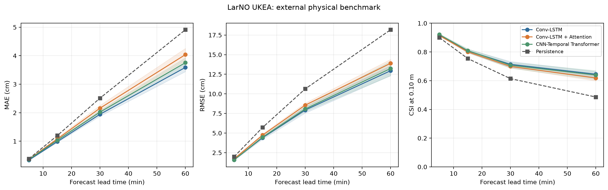
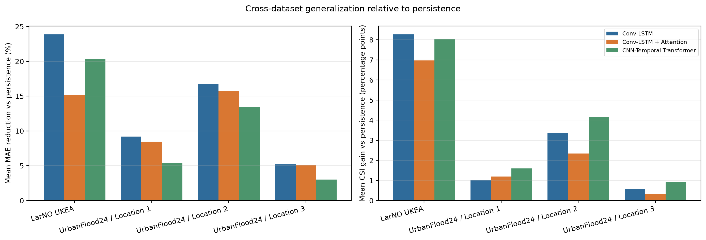
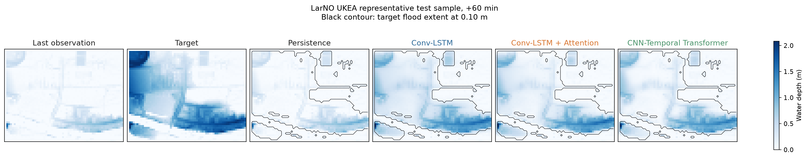
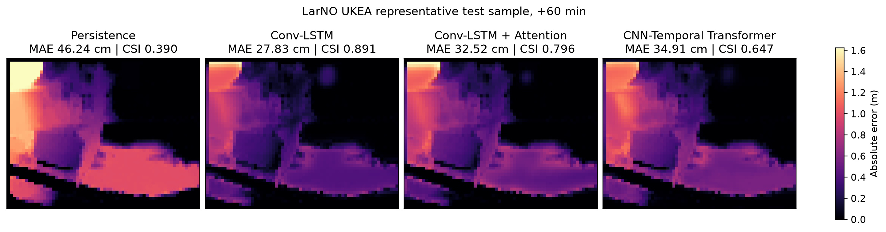
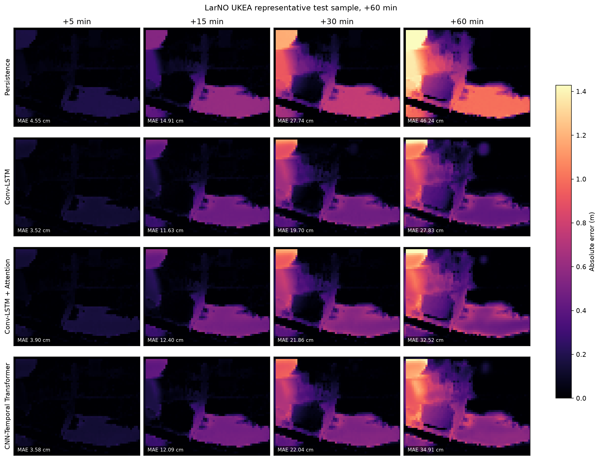
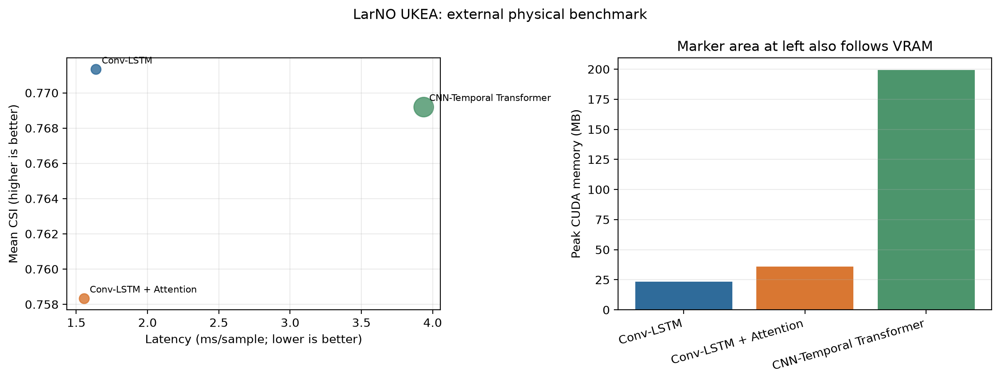
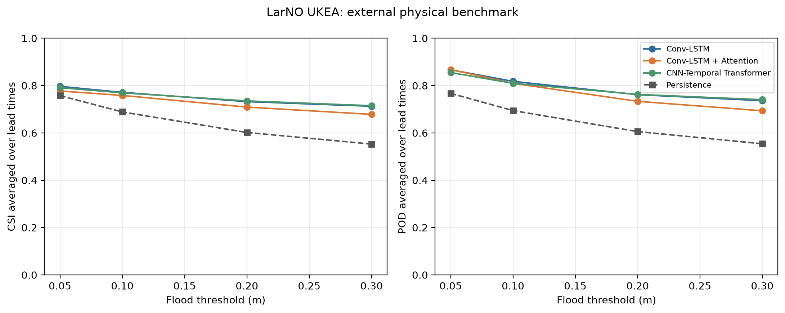

# 外部物理数据实验：UrbanFlood24 与 LarNO UKEA

项目地址：<https://github.com/mrrabbitss/multimodal-flood-forecasting-BXY>

本报告记录项目在保留原始 Conv-LSTM 代码、历史 checkpoint 和既有实验结果的前提下，新增 UrbanFlood24 与 LarNO UKEA 两套物理量洪水模拟数据后的完整实验过程。报告覆盖数据审计、统一协议、模型副本、42 次训练运行、MAE/RMSE/CSI、提前量、阈值、延迟、显存、空间预测图、结论与限制。

## 1. 本轮目标与保护原则

本轮工作的目标不是覆盖历史实验，而是建立一条独立的外部数据验证链路：

- 保留原 Conv-LSTM 源码、历史 checkpoint 和历史合成数据结果。
- 新建三种外部物理数据模型副本：Conv-LSTM、Conv-LSTM + Attention、CNN-Temporal Transformer。
- 将两套来源、时空分辨率和字段结构不同的数据统一到可比较协议。
- 联合预测 `5/15/30/60 min` 四个提前量。
- 输出物理单位 MAE、RMSE，洪水范围 CSI/POD/FAR，以及延迟和峰值显存。
- 使用事件级隔离划分，避免同一降雨事件跨训练集和测试集泄漏。
- 保留负结果和模型权衡，不通过挑选单次运行制造优势。

原有 [src/model.py](src/model.py)、训练入口和既有 checkpoint 均未修改。新增实现集中在：

- `src/external_data.py`
- `src/external_models.py`
- `src/train_external.py`
- `src/run_external_benchmark.py`
- `src/summarize_external.py`
- `src/visualize_external_predictions.py`

## 2. 数据审计

### 2.1 LarNO UKEA

本地数据包含 20 个事件、40 个事件数组和一份 DEM，校验后的总体积约 380 MB。

原始字段：

| 字段 | 原始形状 | 含义 |
|---|---|---|
| `h` | `[36, 50, 120]` | 5 分钟水深序列，单位 m |
| `rainfall` | `[360, 50, 120]` | 1 分钟空间降雨序列 |
| `DEM` | `[50, 120]` | 8 m 地形高程 |

按照 U-RNN 官方预处理逻辑，将降雨前 180 个 1 分钟帧按每 5 帧求和，得到 36 个 5 分钟降雨帧。使用官方 8 个训练事件和 12 个测试事件，再从官方训练事件中固定划出 2 个验证事件，最终事件划分为 `6/2/12`。

### 2.2 UrbanFlood24

本地完整数据约 116.04 GB，共 354 个 `.npy` 文件。三处区域各包含 40 个官方训练事件和 16 个官方测试事件，共 168 个“事件-区域”记录。

主要字段：

| 字段 | 典型形状 | 处理方式 |
|---|---|---|
| Flood depth | `[360,1,500,500]`，Location 2 部分事件为 480 帧 | 5 分钟采样，4 x 4 块平均到约 8 m |
| Rainfall | 实测事件 360 帧；设计暴雨事件 180 帧 | 每 5 个 1 分钟步求和；180 帧后显式补零 |
| DEM | `[500,500]` | 4 x 4 块平均、区域内归一化 |
| Impervious | `[500,500]` | 4 x 4 块平均 |
| Manhole | `[500,500]` | 4 x 4 块平均并归一化 |

适配器使用 NumPy memory mapping 和按需读取，不复制 116 GB 数据，也不生成同体量缓存。每个 Location 的官方训练事件进一步固定划分为 `32/8/16` 个训练、验证和测试事件。

## 3. 统一物理协议

两套数据统一到 `8 m / 5 min`，共同使用 8 个输入通道：

1. `depth_history`
2. `rain_current`
3. `rain_accum_3`
4. `rain_accum_6`
5. `dem`
6. `impervious`
7. `drainage_inlet`
8. `valid_mask`

UKEA 没有 impervious 和 drainage 字段，对应通道显式填零，而不是伪造属性。模型输入为最近 12 个 5 分钟帧，即 60 分钟历史；输出为四个水深图：

```text
X: [batch, 12, 8, 64, 64]
Y: [batch, 4, 64, 64]
lead times: 5, 15, 30, 60 min
```

其他统一设置：

| 设置 | 数值 |
|---|---:|
| Patch size | 64 x 64 |
| Depth normalization upper bound | 3.5 m |
| Rain normalization | 35 mm / 5 min |
| Primary flood threshold | 0.10 m |
| Sensitivity thresholds | 0.05, 0.10, 0.20, 0.30 m |
| Split seed | 44 |
| Optimizer | AdamW |
| Learning rate | 0.0003 |
| Hidden width | 16 |
| Batch size | 4 |
| Mixed precision | Enabled on CUDA |

## 4. 三种模型与训练保护

| 模型 | 参数量 | 外部数据版本的作用 |
|---|---:|---|
| Conv-LSTM | 22,084 | 轻量时空递归基线 |
| Conv-LSTM + Attention | 22,229 | 对全部 Conv-LSTM 隐状态做逐像素时间注意力 |
| CNN-Temporal Transformer | 9,412 | CNN 帧编码后，对每个空间位置做时间 Transformer |

三种模型都采用状态感知残差预测：最后一个观测水深作为持久性起点，网络学习未来变化量。最终预测头零初始化，因此 epoch 0 与持久性预测严格相同。训练只在验证损失改善时保存 checkpoint；如果短训练导致模型变差，最终会自动保留 epoch 0，而不是输出一个低于基线的欠训练模型。

损失函数同时考虑：

- 对积水像素加权的物理 MAE。
- 物理 MSE。
- 0.10 m 洪水范围 BCE。
- 软 Dice 损失。
- 有效区域 mask，填充像素不参与训练和评估。

## 5. 实验规模

### 5.1 UKEA：5-seed 全样本实验

- Seeds：`42, 44, 52, 77, 2026`
- 每模型 5 次，共 15 次训练。
- 每次 `234/52/312` 个训练、验证、测试样本。
- 10 epochs。
- 测试使用全部可用窗口。

### 5.2 UrbanFlood24：三地点 3-seed 稀疏采样实验

- Locations：1、2、3。
- Seeds：`42, 44, 52`。
- 每地点每模型 3 次，共 27 次训练。
- 每次 `256/64/128` 个训练、验证、测试样本。
- 5 epochs。
- 覆盖全部事件，但每个事件固定抽取 8 个时空样本。

总计：`15 + 27 = 42` 次训练运行。UrbanFlood24 结果属于三地点、多 seed 的受控 pilot，不等同于全窗口正式评估。

## 6. UKEA 5-seed 结果

表中 MAE/RMSE 是四个提前量的等权平均，`+/-` 为五个训练 seed 的总体标准差。

| 模型 | MAE cm | RMSE cm | CSI | 相对持久性 MAE 降幅 | CSI 增益 | 延迟 ms/sample | 峰值显存 MB |
|---|---:|---:|---:|---:|---:|---:|---:|
| **Conv-LSTM** | **1.715 +/- 0.060** | **6.720 +/- 0.304** | **0.7713 +/- 0.0131** | **23.9%** | **+8.3 pp** | 1.64 | **23.4** |
| Conv-LSTM + Attention | 1.911 +/- 0.092 | 7.229 +/- 0.244 | 0.7583 +/- 0.0095 | 15.1% | +7.0 pp | **1.55** | 35.9 |
| CNN-Temporal Transformer | 1.795 +/- 0.067 | 6.839 +/- 0.338 | 0.7692 +/- 0.0173 | 20.3% | +8.1 pp | 3.94 | 199.4 |

60 分钟提前量：

| 模型 | MAE cm | 持久性 MAE cm | MAE 降幅 | CSI | 持久性 CSI | CSI 增益 |
|---|---:|---:|---:|---:|---:|---:|
| **Conv-LSTM** | **3.589** | 4.911 | **26.9%** | **0.6453** | 0.4863 | **+15.9 pp** |
| Conv-LSTM + Attention | 4.039 | 4.911 | 17.8% | 0.6185 | 0.4863 | +13.2 pp |
| CNN-Temporal Transformer | 3.757 | 4.911 | 23.5% | 0.6389 | 0.4863 | +15.3 pp |

UKEA 的核心结论是：三种学习模型在整体 MAE 和 CSI 上都超过同测试像素的持久性预测，而且提前量越长，学习模型的相对价值越明显。基础 Conv-LSTM 在本配置下综合最佳；Transformer 很接近，但延迟约为 Conv-LSTM 的 2.4 倍，显存约为 8.5 倍。



## 7. UrbanFlood24 三地点结果

### 7.1 跨地点聚合

以下标准差同时包含地点差异和训练 seed 差异，因此不能解释为纯 seed 方差。

| 模型 | MAE cm | RMSE cm | CSI | MAE 降幅 | CSI 增益 | 延迟 ms/sample | 显存 MB |
|---|---:|---:|---:|---:|---:|---:|---:|
| **Conv-LSTM** | **0.611 +/- 0.184** | 2.967 +/- 0.281 | 0.8272 +/- 0.0352 | **10.4%** | +1.65 pp | 2.00 | **26.7** |
| Conv-LSTM + Attention | 0.615 +/- 0.187 | 3.033 +/- 0.304 | 0.8236 +/- 0.0403 | 9.8% | +1.29 pp | **1.64** | 39.1 |
| CNN-Temporal Transformer | 0.634 +/- 0.203 | **2.862 +/- 0.361** | **0.8329 +/- 0.0353** | 7.3% | **+2.22 pp** | 3.93 | 201.8 |

### 7.2 分地点综合结果

| Location | 模型 | MAE cm | RMSE cm | CSI | MAE 降幅 | CSI 增益 |
|---|---|---:|---:|---:|---:|---:|
| 1 | Conv-LSTM | **0.797** | 2.990 | 0.8470 | **9.2%** | +1.0 pp |
| 1 | Conv-LSTM + Attention | 0.805 | 3.102 | 0.8487 | 8.5% | +1.2 pp |
| 1 | CNN-Temporal Transformer | 0.835 | **2.775** | **0.8527** | 5.4% | **+1.6 pp** |
| 2 | Conv-LSTM | **0.382** | 2.990 | 0.7795 | **16.8%** | +3.3 pp |
| 2 | Conv-LSTM + Attention | 0.387 | 3.024 | 0.7695 | 15.7% | +2.3 pp |
| 2 | CNN-Temporal Transformer | 0.398 | **2.966** | **0.7874** | 13.4% | **+4.1 pp** |
| 3 | Conv-LSTM | **0.653** | 2.921 | 0.8549 | **5.2%** | +0.6 pp |
| 3 | Conv-LSTM + Attention | 0.654 | 2.974 | 0.8526 | 5.1% | +0.3 pp |
| 3 | CNN-Temporal Transformer | 0.668 | **2.844** | **0.8586** | 3.0% | **+0.9 pp** |

UrbanFlood24 显示出清晰的任务权衡：Conv-LSTM 在三个地点的平均 MAE 都最低；Transformer 在三个地点的平均 CSI 都最高，并取得最低的跨地点 RMSE，但代价是明显更高的延迟和显存。Attention 整体超过持久性，却没有稳定超过基础 Conv-LSTM。



## 8. 代表性空间预测

空间样本由程序按“60 分钟真值相对最后观测的变化幅度”自动选择，选择规则不使用任何模型误差，因此不是按模型表现挑选的最好案例。

UKEA 代表片段 `r500y_p0.1_d3h_1`：

| 方法 | 60 min MAE cm | 60 min CSI |
|---|---:|---:|
| Persistence | 46.24 | 0.390 |
| **Conv-LSTM** | **27.83** | **0.891** |
| Conv-LSTM + Attention | 32.52 | 0.796 |
| CNN-Temporal Transformer | 34.91 | 0.647 |







该样本说明模型不只是降低全局平均误差，还能补偿持久性方法无法表示的积水增长。黑色轮廓表示 0.10 m 真值洪水范围。

## 9. 阈值与资源分析

每个模型都在 `0.05/0.10/0.20/0.30 m` 四个阈值上输出 CSI、POD 和 FAR。阈值敏感性图用于判断模型优势是否只发生在单一阈值；效率图同时展示 CSI、延迟和峰值显存。

- Conv-LSTM 提供当前最好的误差-效率平衡。
- Attention 参数增加很少，但隐状态加权会增加显存，且当前简单注意力没有带来稳定精度收益。
- Transformer 参数量最少，但逐像素时间 token 使激活显存远高于参数量所暗示的规模。
- 延迟和显存均在 NVIDIA GeForce RTX 5060 Laptop GPU 上测量，只适合做同设备相对比较。





## 10. 主要结论

1. **外部物理数据链路成立。** 两套数据都能在统一 8 m / 5 min 协议下完成训练、评估和空间可视化，不依赖复制大数据。
2. **持久性是必须保留的强基线。** 短提前量下持久性本身很强；三种模型的主要价值在 30-60 分钟更加明显。
3. **基础 Conv-LSTM 仍是首选回归与部署模型。** 它在 UKEA 和 Urban 三地点上取得最稳的 MAE，同时显存低、推理快。
4. **Transformer 提供范围识别优势。** 它在 Urban 三地点上取得最高 CSI，并在跨地点聚合中取得最低 RMSE，但资源成本最高。
5. **Attention 是有价值的负/中性结果。** 它总体优于持久性，却未建立对基础 Conv-LSTM 的优势，说明“加入注意力”不自动等于更好。
6. **长提前量结果最能体现模型价值。** UKEA 60 分钟时 Conv-LSTM 相对持久性降低 MAE 26.9%，CSI 提升 15.9 个百分点。

## 11. 当前限制

- UKEA 与 UrbanFlood24 是物理模拟数据，不是实际城市传感器观测，不能直接宣称真实部署精度。
- UrbanFlood24 虽覆盖全部事件和三个地点，但每事件仅抽取 8 个时空样本，尚未完成全窗口 5-seed 正式评估。
- 当前报告提供 seed 均值和标准差，但尚未基于逐事件输出做配对 bootstrap 显著性检验。
- 三种模型使用统一预算，没有为每个结构单独进行大规模超参数搜索。
- UKEA 缺少 impervious 和 drainage 字段，相关通道为显式零值；这与 Urban 的完整静态属性不完全对称。
- 当前实验分别在各数据集内训练和测试，尚未验证跨数据集预训练、微调或零样本迁移。
- 64 x 64 patch 评估不能替代整幅城市区域的连贯推理与边界融合评估。

## 12. 复现命令

UKEA 5-seed：

```bash
python -m src.run_external_benchmark --dataset larno_ukea --output_root runs/external_physical/benchmark_v1 --models convlstm,convlstm_attention,cnn_temporal_transformer --seeds 42,44,52,77,2026 --epochs 10 --batch_size 4 --hidden 16 --max_train_samples_per_event 64 --max_eval_samples_per_event 0 --lr 0.0003 --split_seed 44 --device auto --amp
```

UrbanFlood24 Location 2 的 3-seed pilot：

```bash
python -m src.run_external_benchmark --dataset urbanflood24 --location location2 --output_root runs/external_physical/benchmark_v1 --models convlstm,convlstm_attention,cnn_temporal_transformer --seeds 42,44,52 --epochs 5 --batch_size 4 --hidden 16 --max_train_samples_per_event 8 --max_eval_samples_per_event 8 --lr 0.0003 --split_seed 44 --device auto --amp
```

重新汇总全部结果：

```bash
python -m src.summarize_external --input_root runs/external_physical/benchmark_v1 --output_dir runs/external_physical/benchmark_v1/summary
```

生成空间预测图：

```bash
python -m src.visualize_external_predictions --checkpoint_root runs/external_physical/benchmark_v1/larno_ukea/ukea --output_dir runs/external_physical/benchmark_v1/summary/spatial_showcase --seed 42 --device auto
```

## 13. 已提交的轻量证据

可公开、可审查的汇总文件位于 `docs/experiments/external_physical_v1/`：

- 数据集、地点、模型和提前量汇总 CSV。
- 四阈值敏感性 CSV。
- 42 次运行的轻量 per-run 表。
- 不含本机绝对路径的 JSON 汇总。
- 四组实验配置 manifest。
- 两个代表性空间样本的指标 JSON。

全部大型 `.npy` 数据、训练 checkpoint 和 `runs/` 中间产物继续由 `.gitignore` 排除，以保持 GitHub 仓库轻量。
