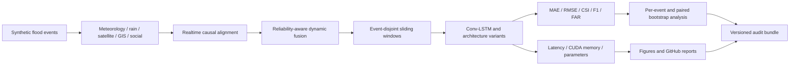

# 多模态城市内涝预测项目：全周期研发、实验与成果报告

> 更新时间：2026-07-14<br>
> GitHub：[mrrabbitss/multimodal-flood-forecasting-BXY](https://github.com/mrrabbitss/multimodal-flood-forecasting-BXY)<br>
> 项目定位：面向城市内涝风险图预测的多模态、时空深度学习与可复现实验工程

---

## 1. 报告目的

本文从项目最初的端到端原型开始，系统整理截至当前版本完成的研究尝试、工程优化、模型实验、失败探索、量化结果与阶段性结论。它既是一份项目研发记录，也可用于 GitHub 项目展示、课程答辩、面试讲解和个人技术能力证明。

整个项目始终遵循以下原则：

1. **先建立完整工程闭环，再逐步提升模型和实验可信度。**
2. **原始 Conv-LSTM、checkpoint 和历史结果只读保留，新尝试写入独立代码、分支和运行目录。**
3. **不同数据、schema、训练预算和测量协议的结果不直接混为一谈。**
4. **成功与失败实验都保留，不通过筛选随机种子或隐藏负结果制造“优越性”。**
5. **项目优势必须由固定划分、强 baseline、多随机种子、逐事件统计和审计清单共同支撑。**

---

## 2. 项目一句话概括

本项目构建了一套完整的多模态城市内涝预测系统：从合成洪涝事件出发，模拟气象、降雨、遥感、GIS 和社交众包等异步、有噪声、有延迟、有缺失的数据源，经过实时因果对齐与可靠性门控融合，再使用 Conv-LSTM、Attention、Transformer、U-Net、3D CNN、ConvGRU 和 Conv-LSTM U-Net 等时空模型预测未来水深风险图，并使用 MAE、RMSE、CSI、F1、FAR、延迟和显存进行统一评估。

项目不是一个孤立的模型脚本，而是完整覆盖：

```text
数据生成
  -> 多源异步观测
  -> 严格因果对齐
  -> 可靠性门控融合
  -> 滑动窗口与事件级划分
  -> 时空模型训练
  -> 多指标与逐事件评估
  -> 多 seed / bootstrap / 提前量实验
  -> 图表、文档、Git 与 SHA-256 审计
```

---

## 3. 当前成果概览

### 3.1 可核验的工作量

截至本报告撰写前，GitHub 仓库包含：

| 项目量化项 | 当前规模 |
|---|---:|
| 核心功能里程碑提交 | 9 个，不含本报告提交 |
| Python 源码文件 | 41 个 |
| Python 源码行数 | 6,644 行 |
| 自动化测试文件 | 17 个 |
| 测试代码行数 | 553 行 |
| 当前 pytest 用例 | 40 个，全部通过 |
| 神经模型家族 | 7 类 |
| GitHub 展示图 | 17 张 |
| 精选实验表与 manifest | 16 个 |
| Git 跟踪文件 | 116 个，不含本报告 |
| Batch4 正式模型训练 | 4 模型 x 5 seeds = 20 组 |
| Batch4 配对 bootstrap | 30 组比较 x 10,000 次重采样 |

按现有运行记录保守统计，项目完成了**至少 51 组神经网络训练或微调配置**：包括历史容量/seed 网格、100 事件实验、自动阈值模型、混合损失微调、Attention/Transformer、降雨输入消融、多 seed 扩展、5 个提前量、6 个模态配置和 Batch4 的 20 组正式训练。这个统计还没有计入非神经 baseline、阈值扫描、ensemble、重复确定性评估和大量 smoke test。

### 3.2 已实现的模型

| 类型 | 模型 | 用途 |
|---|---|---|
| 主模型 | Conv-LSTM | 保留的历史最佳单模型 |
| 架构扩展 | Conv-LSTM + Attention | 验证时序注意力是否带来收益 |
| 架构扩展 | CNN-Temporal Transformer | 验证卷积空间编码与 Transformer 时序建模 |
| 强 baseline | U-Net Single Frame | 检验最后一帧和空间捷径有多强 |
| 强 baseline | 3D CNN | 联合局部时空卷积 |
| 强 baseline | ConvGRU | 轻量循环时序建模 |
| 多提前量候选 | Multi-Horizon Conv-LSTM U-Net | Conv-LSTM 与多尺度 U-Net 解码器结合 |

此外还实现了 zero-depth、气象持久性、融合结果持久性、风险分数持久性、遥感代理、社交持久性和线性外推等非神经 baseline，以及多 checkpoint ensemble。

### 3.3 当前最重要的三个结果

1. **历史 60 事件基准：Conv-LSTM 是当前部署候选。** 其 `MAE=0.0547086`、`CSI=0.9370353`、`F1=0.9674943`，明显优于持久性 baseline，也优于当前实现的 Attention 和 Transformer 变体。
2. **因果降雨输入：累计降雨显著改善回归误差。** 三随机种子实验中，当前及累计降雨方案相对历史输入将平均 MAE 从 `0.1434` 降至 `0.0824`，降幅约 `42.5%`；逐事件 MAE 改善的 95% CI 为 `[0.0191, 0.1112]`。
3. **Batch4 多提前量基准：3D CNN 在统一三轮预算下准确率最佳。** 五 seed 平均 `MAE=0.0817`、`CSI=0.8779`；首版 Conv-LSTM U-Net 没有超过强 baseline，这一负结果被完整保留。

---

## 4. 系统架构与技术路线



### 4.1 数据层

项目不是直接随机生成输入矩阵，而是先构造隐含真实水深场 `gt_depth`，再模拟不同来源对同一洪涝过程的观测：

| 模态 | 主要字段 | 模拟特性 |
|---|---|---|
| 气象/水深代理 | `meteo_depth` | 高频连续，但存在噪声和系统偏差 |
| 降雨 | `rain_current`、`rain_accum_3/6/12` | 当前降雨、累计降雨、峰值和趋势 |
| 遥感 | `sat_base`、`sat_quality` | 低频、滞后、可能缺失 |
| GIS | `gis_risk`、`gis_quality` | 静态或低频风险背景 |
| 社交众包 | 深度、mask、count、confidence、age | 稀疏、延迟、空间覆盖不均 |
| 城市背景 | `exposure`、`drainage_capacity` | 暴露度与排水能力 |
| 可靠性元数据 | `miss_*`、`dt_*`、`q_*`、`n_soc` | 缺失、年龄、质量与报告数量 |

### 4.2 对齐与融合层

- `realtime` 模式只允许使用锚点时刻及以前的观测。
- 遥感、GIS 和社交数据保留被选择观测的源时间戳，可进行因果审计。
- 缺失模态的融合权重严格为 0。
- 观测年龄影响可靠性权重，不再默认对观测值本身重复衰减。
- 旧双重衰减行为保留为 `legacy` 模式，支持历史复现。

### 4.3 模型层

历史 Conv-LSTM 主模型结构为：

```text
Input [B,T,C,H,W]
  -> Conv2d encoder + BatchNorm + ReLU
  -> ConvLSTMCell x num_layers
  -> Conv2d prediction head
  -> bounded normalized-depth output
Output [B,1,H,W]
```

Batch4 将目标扩展为：

```text
Input:  [B,12,23,H,W]
Output: [B,5,H,W]
Leads:  [1,3,6,12,24]
```

### 4.4 训练与评估层

- AdamW、AMP 混合精度、梯度裁剪、ReduceLROnPlateau 和 early stopping。
- 高风险区域加权 MAE/MSE，以及可选 BCE、Dice、Focal、temporal 和 edge loss。
- 事件级而非窗口级 train/validation/test 划分。
- MAE、RMSE、Precision、POD、F1、CSI/IoU、FAR、HSS、ETS、frequency bias、范围误差和峰值误差。
- 推理延迟、峰值 CUDA 显存和参数量对比。
- 逐事件指标、seed 均值/标准差和配对 bootstrap 置信区间。

---

## 5. 阶段一：从零建立端到端工程闭环

### 5.1 最初完成的能力

项目最初先打通：

```text
generate_synthetic
  -> align_modalities
  -> fuse_dynamic_gate
  -> train
  -> evaluate
  -> predict_visualize
```

这一阶段的价值在于证明：可以把异步多模态数据生成、对齐、融合、时空建模、风险图评估与可视化放入一条能够运行的工程链路，而不是只完成一个模型 notebook。

### 5.2 数据规模扩展

| 数据规模 | 目的 | 观察 |
|---:|---|---|
| 6 events | 快速 smoke test | 验证端到端流程，不用于正式结论 |
| 20 events | 默认小规模实验 | 能完成训练，但 seed 和测试事件波动较大 |
| 60 events | 历史主基准 | 形成当前最佳 Conv-LSTM checkpoint |
| 100 events | 更大数据与边界修复 | 新分布更难，Conv-LSTM CSI 约 0.889，仍优于 persistence |
| 48 x 72 steps | Batch4 多提前量正式集 | 每个 lead 均有 296 个测试窗口 |

从 6 事件 smoke test 到 100 事件扩展，再到专门为多提前量设计的 48 个长事件，体现了从“能运行”到“能做公平实验”的数据工程推进过程。

---

## 6. 阶段二：历史 Conv-LSTM 调参与传统实验

### 6.1 容量和随机种子网格

在旧 60 事件数据上，对 hidden、层数和随机种子进行了网格实验：

| 配置 | Hidden | Layers | Seed/Split | MAE | CSI | FAR | 结论 |
|---|---:|---:|---:|---:|---:|---:|---|
| h24_l1_seed43 | 24 | 1 | 43 | 0.058499 | 0.927723 | 0.034029 | 稳定但非最优 |
| h24_l1_seed44 | 24 | 1 | 44 | 0.053648 | 0.922882 | 0.016899 | MAE/FAR 好，CSI 略低 |
| h32_l1_seed43 | 32 | 1 | 43 | 0.064773 | 0.911867 | 0.064226 | seed 波动明显 |
| **h32_l1_seed44** | **32** | **1** | **44** | **0.054708** | **0.936756** | **0.025051** | **最佳单模型** |
| h24_l2_seed44 | 24 | 2 | 44 | 0.059173 | 0.924720 | - | 加深未带来稳定收益 |

由此得出：

- 模型更深或 hidden 更大并不自动更好。
- seed 和事件划分对小型合成 benchmark 有明显影响。
- `hidden=32, num_layers=1, seed/split=44` 是当前最值得保留的历史单模型。

### 6.2 风险阈值扫描

| 阈值 | CSI | F1 | FAR |
|---:|---:|---:|---:|
| 0.30 | 0.936756 | 0.967345 | 0.025051 |
| **0.28** | **0.937035** | **0.967494** | 0.025316 |

阈值从 `0.30` 调整到 `0.28` 后，CSI/F1 小幅提升，因此历史推荐阈值设为 `0.28 normalized_depth`。后续正确性修复进一步明确：该数值是合成数据归一化阈值，不是厘米或米。

### 6.3 与非神经 baseline 对比

旧 60 事件测试集、阈值 `0.30`：

| 方法 | MAE | RMSE | CSI | F1 | FAR |
|---|---:|---:|---:|---:|---:|
| **Conv-LSTM** | **0.054708** | **0.071491** | **0.936756** | **0.967346** | **0.025050** |
| persistence meteo | 0.109743 | 0.141487 | 0.783592 | 0.878668 | 0.111476 |
| persistence risk score | 0.177926 | 0.214935 | 0.671077 | 0.803167 | 0.098146 |
| persistence fused | 0.170264 | 0.216265 | 0.659448 | 0.794780 | 0.062212 |
| satellite proxy | 0.247128 | 0.304206 | 0.588102 | 0.740635 | 0.244475 |
| social persistence | 0.401472 | 0.475900 | 0.024329 | 0.047502 | 0.140535 |
| zero depth | 0.409268 | 0.482316 | 0.000000 | 0.000000 | 0.000000 |

相较最强的 `persistence_meteo`，Conv-LSTM：

- MAE 降低约 `50.1%`；
- CSI 提高约 `0.1532`；
- FAR 从 `0.1115` 降至 `0.0251`。

这证明当前数据上模型不是只复制最后时刻，而是学到了能够超过简单持久性预测的时空映射。


### 6.4 Ensemble 尝试

| 方法 | MAE | RMSE | CSI | F1 | FAR |
|---|---:|---:|---:|---:|---:|
| 最佳单模型 | 0.054708 | 0.071491 | **0.936756** | **0.967345** | 0.025051 |
| 3 模型 ensemble，阈值 0.30 | **0.051923** | **0.069005** | 0.934036 | 0.965893 | 0.017946 |
| 3 模型 ensemble，阈值 0.28 | **0.051923** | **0.069005** | 0.934753 | 0.966276 | **0.017482** |

结论不是简单的“ensemble 更好”或“更差”，而是形成了业务权衡：

- 更看重水深误差和低误报时，ensemble 更有吸引力。
- 以 CSI/F1 为主要排序指标时，最佳单模型仍更合适。

### 6.5 自动阈值校准尝试

| checkpoint 选择方式 | 自动阈值 | MAE | CSI | F1 | 结果 |
|---|---:|---:|---:|---:|---|
| 按验证 CSI | 0.34 | 0.082612 | 0.904453 | 0.949829 | 对单验证集过拟合 |
| 按验证 loss | 0.24 | 0.066378 | 0.914091 | 0.955118 | 仍低于固定阈值强基线 |

该尝试没有成功，但它揭示了重要问题：单一验证集上的自动阈值容易受事件分布影响。当前没有为了“自动化”而强行替代更稳定的固定阈值，而是把独立验证集和多 split 校准保留为后续任务。

### 6.6 BCE/Dice 混合损失微调

从最佳 checkpoint 以低学习率加入 BCE/Dice 微调后，最佳仍停留在 epoch 0，说明新损失没有超过初始模型：

| 模型 | MAE | CSI | F1 | 结论 |
|---|---:|---:|---:|---|
| 初始最佳模型 | 0.054708 | 0.936756 | 0.967345 | 强基线 |
| 混合损失微调 | 0.054709 | 0.936756 | 0.967346 | 没有有效提升 |

这项实验验证了 `--init_checkpoint` 和“退化时保留初始权重”的机制，也避免把无效微调包装成改进。

### 6.7 边缘伪影修复与 100 事件实验

项目发现原合成平滑使用 `np.roll`，会将一侧边界卷到另一侧。随后完成：

- 合成平滑改为 reflect padding；
- 模型卷积使用 `padding_mode="reflect"`；
- 可视化改用 nearest，并支持裁边检查。

100 事件 reflect 数据上：

| 方法 | 阈值 | MAE | CSI | F1 |
|---|---:|---:|---:|---:|
| Conv-LSTM | 0.26 | 0.077202 | **0.889404** | **0.941465** |
| persistence meteo | 0.26 | 0.106405 | 0.808477 | 0.894097 |
| persistence fused | 0.26 | 0.173181 | 0.719631 | 0.836960 |

新数据更难且分布不同，不能与旧 60 事件结果直接硬比；但 Conv-LSTM 在新数据上仍明显优于 persistence baseline。

---

## 7. 阶段三：Attention 与 Transformer 架构扩展

在不修改历史 Conv-LSTM 的前提下，新增：

- Conv-LSTM + Attention；
- CNN-Temporal Transformer；
- 独立训练、checkpoint、评估、延迟和显存脚本；
- 三模型对比图、雷达图、训练曲线和效率图。

同一历史 fused 数据、split seed `44`、阈值 `0.28` 下：

| 模型 | 参数量 | MAE | RMSE | CSI | F1 | FAR | 延迟 ms/样本 | CUDA MB |
|---|---:|---:|---:|---:|---:|---:|---:|---:|
| **Conv-LSTM** | 86,977 | **0.0547** | **0.0715** | **0.9370** | **0.9675** | **0.0253** | **1.674** | **42.65** |
| Conv-LSTM + Attention | 87,522 | 0.0703 | 0.0911 | 0.8957 | 0.9450 | 0.0483 | 1.894 | 88.41 |
| CNN-Temporal Transformer | 48,225 | 0.0795 | 0.1001 | 0.8657 | 0.9280 | 0.1097 | 8.055 | 259.32 |


结论：

- 原 Conv-LSTM 在该具体数据、实现和训练预算下综合最优。
- Attention 增加了显存，但没有换来更好的 CSI。
- 当前 Transformer 配置速度和显存代价较高，也没有超过 Conv-LSTM。
- 这不是“Transformer 一般性弱于 Conv-LSTM”的结论，而是一次具体架构和预算下的实验结果。

这一阶段体现的不只是增加模型数量，更重要的是建立了**公平读取历史 checkpoint、隔离新输出、统一效率测量和保留负结果**的比较方式。

---

## 8. Batch1：正确性、可信度与兼容性修复

Batch1 将重点从追求分数转向审计数据、模型和指标是否一致。

### 8.1 发现的问题

1. 标签上限、模型输出上限和阈值语义没有统一对象。
2. 遥感/GIS 可能在对齐和融合阶段发生双重时间衰减。
3. 社交值为 0 时无法区分“有效观测为 0”和“没有观测”。
4. 旧 13 通道依赖隐式顺序，新增字段后存在静默错位风险。
5. 训练和验证 loss 需要共享同一配置。
6. realtime 流程必须明确阻止未来数据泄漏。

### 8.2 完成的优化

- 建立统一 `DepthScale` 与 `RiskThreshold`。
- 新实验标签和输出范围统一为 `[0.0, 1.2] normalized_depth`。
- 阈值保存数值、单位和含义。
- 默认取消遥感/GIS 观测值双重衰减，保留 legacy 复现模式。
- 社交数据新增 observation mask、count、confidence、age 图。
- 建立 19 通道 Batch1 schema，并保留旧 13 通道 schema。
- checkpoint 保存通道名称和顺序。
- 训练和验证共享 `LossConfig`。
- 新增 HSS、ETS、frequency bias、flood extent error 和 peak depth error。
- 建立严格 realtime 因果检查与自动化测试。

### 8.3 兼容性结果

修复后的代码读取原 checkpoint 后复现：

| MAE | RMSE | CSI | F1 | FAR | 测试窗口 |
|---:|---:|---:|---:|---:|---:|
| 0.0547086 | 0.0714920 | 0.9370353 | 0.9674943 | 0.0253156 | 495 |

这证明 Batch1 没有破坏原 Conv-LSTM。其核心价值是可信度、兼容性和未来扩展能力，而不是重新包装历史分数。

---

## 9. Batch2：严格因果降雨输入与数据 Schema

### 9.1 研究问题

旧模型没有把降雨过程作为一组明确、可解释的特征直接输入模型。Batch2 验证：

> 当前降雨与近期累计降雨，能否在不依赖未来信息的前提下改善预测？

### 9.2 新增特征

```text
rain_current
rain_accum_3
rain_accum_6
rain_accum_12
rain_max_recent_6
rain_trend_3
```

- 所有派生量只使用当前及历史降雨。
- 3/6/12 步累计量按窗口长度归一化。
- 因果验证会重新计算派生字段并检查一致性。
- 默认 schema 扩展为 23 个具名通道。
- 保留 19 通道 Batch1 和 13 通道 legacy 兼容路径。
- 推理前严格校验 checkpoint 与数据 schema。

### 9.3 A/B/C 单 seed 消融

20 事件、3 epochs、hidden 12、lead 6、固定阈值 0.28：

| 方案 | 输入 | 通道 | 参数量 | MAE | RMSE | CSI | F1 | FAR |
|---|---|---:|---:|---:|---:|---:|---:|---:|
| A | 历史输入 | 13 | 13,177 | 0.149075 | 0.177112 | 0.652258 | 0.789535 | 0.347742 |
| B | A + 当前降雨 | 14 | 13,285 | 0.106507 | 0.141369 | 0.658394 | 0.794014 | 0.341606 |
| **C** | **A + 当前及累计降雨** | **17** | **13,609** | **0.077585** | **0.097540** | **0.691391** | **0.817541** | **0.308345** |


相对 A：

- B 的 MAE 降低 `28.6%`；
- C 的 MAE 降低 `48.0%`；
- C 的 CSI 增加 `0.0391`；
- C 参数量只增加约 `3.3%`；
- B 和 C 在本次三个测试事件上均提高 CSI。

Batch2 的正确结论是“累计降雨值得继续验证”，而不是直接宣称已经普遍优越，因为当时只有一个 seed 和三个测试事件。

---

## 10. Batch3：可复现、多随机种子与统计实验体系

Batch3 将项目从“单次跑分”升级为“事件级可复现和可统计比较”。

### 10.1 工程能力扩展

- 固化事件级 train/validation/test manifest。
- 阻止同一事件的滑动窗口跨集合泄漏。
- 保存 per-seed、mean、std、min 和 max。
- 保存逐事件指标与候选/基线配对差异。
- 实现 10,000 次 paired bootstrap 95% CI。
- 统一“正改善代表候选方案更好”的差异方向。
- 增加 `1/3/6/12/24` 多提前量工具。
- 增加 raw、fused、rain、meta 和 leave-one-modality-out 通道组合。
- 增加 persistence 和 linear extrapolation baseline。
- 输出误差条、置信区间、提前量曲线和模态消融图。

### 10.2 三随机种子降雨结果

固定 split seed 44，训练 seeds `42/44/52`：

| 方案 | MAE mean +/- std | RMSE mean +/- std | CSI mean +/- std | FAR mean +/- std |
|---|---:|---:|---:|---:|
| A：历史 13 通道 | 0.1434 +/- 0.0132 | 0.1688 +/- 0.0149 | 0.6515 +/- 0.0013 | 0.3310 +/- 0.0290 |
| B：增加当前降雨 | 0.0969 +/- 0.0115 | 0.1218 +/- 0.0191 | 0.6799 +/- 0.0427 | 0.3177 +/- 0.0468 |
| **C：当前及累计降雨** | **0.0824 +/- 0.0042** | **0.1013 +/- 0.0034** | **0.6885 +/- 0.0345** | **0.2898 +/- 0.0655** |


C 相对 A：

- 平均 MAE 降低约 `42.5%`；
- MAE 标准差从 `0.0132` 降到 `0.0042`；
- 逐事件 MAE 平均改善 `0.0610`；
- MAE 改善 95% CI 为 `[0.0191, 0.1112]`，完全大于 0；
- CSI 平均改善 `0.0266`，但 95% CI `[-0.0009, 0.0652]` 跨过 0。


因此项目只把“MAE 改善”作为更可靠结论，没有把 CSI 平均提升夸大为统计显著。

### 10.3 提前量诊断

| Lead | 测试样本 | MAE | RMSE | CSI | FAR | POD |
|---:|---:|---:|---:|---:|---:|---:|
| 1 | 72 | 0.1061 | 0.1284 | 0.6560 | 0.3440 | 1.0000 |
| 3 | 66 | 0.0835 | 0.1063 | 0.6551 | 0.3449 | 1.0000 |
| 6 | 57 | 0.0957 | 0.1138 | 0.6523 | 0.3477 | 1.0000 |
| 12 | 39 | 0.1854 | 0.2232 | 0.5288 | 0.4712 | 1.0000 |
| 24 | 3 | 0.3996 | 0.4296 | 0.3398 | 0.6602 | 1.0000 |


诊断显示 lead 12/24 明显退化；lead 24 只有三个测试样本，因此只能作为压力测试。这个不足直接推动了 Batch4 的“更长事件 + 每个 lead 相同样本数”设计。

### 10.4 模态消融 smoke test

| 方案 | MAE | CSI | 观察 |
|---|---:|---:|---|
| full | 0.1054 | 0.6529 | 完整输入 |
| no satellite | 0.1392 | 0.6523 | MAE 变差 |
| no GIS | 0.1311 | 0.6540 | MAE 变差 |
| no social | 0.1148 | 0.6523 | 小幅变差 |
| no meteo | 0.1766 | 0.6523 | MAE 退化最大 |
| no metadata | 0.1110 | 0.6593 | 小预算下未退化 |

由于该实验只有一个 seed、一个 epoch，项目只把它定义为流水线 smoke test，没有用它正式排列模态重要性。

---

## 11. Batch4：更长事件、五种子、三个强 baseline 与多提前量 Conv-LSTM U-Net

### 11.1 为什么需要 Batch4

Batch3 暴露了三个问题：

1. lead 24 样本数过少；
2. 单一 Conv-LSTM 缺少足够强的神经 baseline；
3. 需要五 seed 和联合多提前量输出，而不是每个 lead 独立诊断。

### 11.2 正式协议

| 设置 | 数值 |
|---|---|
| 合成事件 | 48 个 |
| 每事件时间步 | 72 |
| 网格 | 32 x 32 |
| 输入 | 12 帧、23 通道 |
| 输出 lead | 1、3、6、12、24 |
| 事件划分 | 33 train / 7 validation / 8 test |
| 每事件窗口 | 37 |
| 每个 lead 测试窗口 | 296 |
| seeds | 42、44、52、77、2026 |
| 训练预算 | 3 epochs、batch 8、hidden 12 |
| 风险阈值 | 0.28 normalized_depth |
| 正式训练 | 4 模型 x 5 seeds = 20 组 |

48 个事件全部通过最大 lead 24 的 realtime 因果检查。四模型共享数据、划分、seed 集合、训练轮数、hidden 宽度、阈值和 loss；但参数量没有匹配，因此它是统一训练协议比较，不是等容量比较。

### 11.3 五 seed 总体结果

| 模型 | 参数量 | MAE | RMSE | CSI | F1 | 延迟 ms/样本 | CUDA MB |
|---|---:|---:|---:|---:|---:|---:|---:|
| U-Net Single Frame | 27,605 | 0.0828 +/- 0.0020 | 0.1139 +/- 0.0048 | 0.8672 +/- 0.0099 | 0.9288 +/- 0.0056 | **0.1757** | **14.89** |
| **3D CNN** | 15,437 | **0.0817 +/- 0.0042** | **0.1115 +/- 0.0030** | **0.8779 +/- 0.0156** | **0.9349 +/- 0.0090** | 0.2516 | 34.97 |
| ConvGRU | **14,393** | 0.0836 +/- 0.0087 | 0.1119 +/- 0.0078 | 0.8693 +/- 0.0104 | 0.9301 +/- 0.0060 | 0.8617 | 17.26 |
| Multi-Horizon Conv-LSTM U-Net | 61,325 | 0.0891 +/- 0.0070 | 0.1224 +/- 0.0078 | 0.8583 +/- 0.0118 | 0.9237 +/- 0.0068 | 1.4073 | 15.96 |


这一阶段不同模型各有清晰优势：

- **3D CNN：准确率最佳。** MAE、RMSE、CSI 和 F1 均为四模型最佳。
- **单帧 U-Net：速度与峰值显存最佳。** 它也说明合成数据中最后一帧存在较强空间捷径。
- **ConvGRU：参数最少。** 在 14,393 参数下保持有竞争力的精度。
- **Conv-LSTM U-Net：首版未胜出。** 参数最多、速度最慢，当前配置没有证明复杂度合理。

### 11.4 多提前量结果

以下每格为 `MAE / CSI`：

| 模型 | Lead 1 | Lead 3 | Lead 6 | Lead 12 | Lead 24 |
|---|---:|---:|---:|---:|---:|
| U-Net | **0.0528** / 0.9032 | **0.0489** / 0.9124 | **0.0595** / 0.9067 | 0.1094 / 0.8364 | 0.1432 / 0.8068 |
| 3D CNN | 0.0580 / **0.9081** | 0.0522 / **0.9250** | 0.0621 / 0.9105 | **0.0998 / 0.8500** | **0.1365 / 0.8202** |
| ConvGRU | 0.0596 / 0.8903 | 0.0542 / 0.9189 | 0.0629 / **0.9154** | 0.1020 / 0.8328 | 0.1395 / 0.8148 |
| Conv-LSTM U-Net | 0.0576 / 0.8908 | 0.0553 / 0.9127 | 0.0707 / 0.8957 | 0.1146 / 0.8186 | 0.1473 / 0.8028 |


所有模型在 lead 12/24 都退化，但这次每个 lead 都有 296 个测试窗口，长提前量结论比 Batch3 稳定得多。

### 11.5 配对 bootstrap 对首版候选的判断

8 个测试事件先跨 5 seeds 求均值，再进行 10,000 次配对 bootstrap。lead 6 上 Conv-LSTM U-Net 相对强 baseline 的多项区间完全小于 0：

| Baseline | 指标 | 候选改善 | 95% CI |
|---|---|---:|---:|
| U-Net | MAE | -0.0112 | [-0.0177, -0.0050] |
| 3D CNN | MAE | -0.0085 | [-0.0149, -0.0034] |
| 3D CNN | CSI | -0.0145 | [-0.0241, -0.0049] |
| ConvGRU | MAE | -0.0078 | [-0.0128, -0.0031] |
| ConvGRU | CSI | -0.0187 | [-0.0302, -0.0066] |

因此项目没有把“使用了 Conv-LSTM U-Net”写成“Conv-LSTM U-Net 更强”，而是得出更有价值的结论：**当前合成任务首先需要战胜单帧空间捷径；更复杂的时序模型必须用更长训练、残差目标、等参数量和真实数据证明自身价值。**


---

## 12. P0 正确性与可复现审计闭环

原始增强计划的十项 P0 已全部形成代码和证据：

| P0 项目 | 完成内容 |
|---|---|
| 输出与标签上限一致 | 统一 `DepthScale` |
| 阈值语义 | 保存 value、unit、meaning |
| 降雨输入 | 当前、累计、峰值与趋势特征 |
| 双重衰减 | 修复默认路径并保留 legacy |
| 社交 mask | 区分有效 0 与缺失 |
| 质量 metadata | 补齐 miss、dt、q、count 等字段 |
| 统一 loss | 训练与验证共享 `LossConfig` |
| 严格因果测试 | 时间戳与派生降雨字段检查 |
| 多随机种子入口 | Batch3 三 seed、Batch4 五 seed |
| 结果和数据版本清单 | `capture_baseline.py` 与审计包 |

### 12.1 一键审计工具

`scripts/capture_baseline.py` 可以记录：

- Python、依赖、PyTorch、CUDA、cuDNN、CPU、内存和 GPU；
- Git commit、分支、origin 和生成前工作区状态；
- 模型结构、通道、schema、loss、阈值和事件划分；
- MAE/RMSE/CSI/F1/FAR、延迟与峰值显存；
- checkpoint 与全部 60 个 fused 事件文件 SHA-256；
- 根审计 JSON 的聚合哈希。

### 12.2 确定性评估修复

在正式审计时发现：如果先执行性能 warmup，cuDNN 算法选择可能让 MAE 出现约百万分之几的漂移。随后完成：

- 指标推理明确使用 deterministic cuDNN；
- benchmark 移到指标推理之后；
- benchmark 前释放最后一个 GPU 输入张量；
- 连续运行两次，逐字段比较核心指标和混淆矩阵。

两次结果完全一致：

| MAE | RMSE | CSI | F1 | FAR | 测试窗口 |
|---:|---:|---:|---:|---:|---:|
| 0.0547086373 | 0.0714920014 | 0.9370353465 | 0.9674943138 | 0.0253155724 | 495 |

审计身份：

```text
checkpoint SHA-256:
388a5ebd7517a54b2d12dad0a73ede0f6587d9bc8a0c96e91b180507958b598f

60-event dataset aggregate SHA-256:
d508ff249aee205f8946d01f847fd07a701ca63e468667accb458357678de3fa
```

固定 batch 8、预热 2 batch、测量 20 batch，在 RTX 5060 Laptop GPU 上记录 `1.3716 ms/sample` 与 `84.67 MB` 峰值显存。该结果与早期 batch 4 延迟表使用不同测量协议，不能直接硬比较。

### 12.3 GitHub 工程化与展示体系

项目在原始完整目录之外建立了独立 Git 仓库，并完成以下交付工作：

- 将源码、测试、配置、精选 CSV/JSON 和展示图片纳入版本控制；
- 使用 `.gitignore` 排除大型 `.npz`、checkpoint、完整 `runs/` 和本地环境文件；
- 保留 README、项目报告、数据卡、限制说明、Changelog 和各 Batch 实验报告；
- 为 Batch1、Batch2、Batch3、Batch4 和 P0 审计分别建立功能分支；
- 每个阶段完成测试、提交、功能分支推送和 `main` 快进；
- 生成模型记分卡、架构仪表盘、阈值敏感性、训练曲线、雷达图、降雨消融、bootstrap、提前量和效率图；
- 将完整运行产物保存在原目录，将轻量可审计结果同步到 GitHub。

这种双目录策略同时满足了两类需求：原目录保留全部数据和 checkpoint，GitHub 仓库保持轻量、清晰、可阅读和适合公开展示。

GitHub 仓库：**[mrrabbitss/multimodal-flood-forecasting-BXY](https://github.com/mrrabbitss/multimodal-flood-forecasting-BXY)**

---

## 13. 全部关键尝试的结果归纳

| 尝试 | 是否达到预期 | 得到的价值 |
|---|---|---|
| 端到端多模态闭环 | 是 | 从数据到预测图完整可运行 |
| 扩大到 60 事件 | 是 | 形成历史最佳 checkpoint |
| 扩大 hidden 到 32 | 部分 | seed44 最优，但 seed43 波动明显 |
| 增加到 2 层 Conv-LSTM | 否 | 更深没有稳定收益 |
| 阈值 0.30 -> 0.28 | 小幅成功 | CSI/F1 稳定小幅改善 |
| persistence baseline | 是 | 证明模型并非只复制最后一帧 |
| 3 模型 ensemble | 部分 | MAE/RMSE/FAR 更好，CSI/F1 略降 |
| 单验证集自动阈值 | 否 | 揭示阈值过拟合风险 |
| BCE/Dice 微调 | 否 | 保留 epoch0 强基线，验证回退机制 |
| reflect padding | 是 | 修复边界卷绕伪影 |
| 100 事件新分布 | 是 | 更难数据上仍超过 persistence |
| Conv-LSTM + Attention | 否 | 当前预算下精度和效率均未胜出 |
| CNN-Temporal Transformer | 否 | 当前实现成本高且未胜出 |
| 当前降雨输入 | 是 | 单 seed MAE 降低 28.6% |
| 当前及累计降雨 | 是 | 单 seed MAE 降低 48.0% |
| 三 seed 降雨复验 | 是，主要针对 MAE | MAE 改善 CI 完全大于 0 |
| CSI 多 seed 改善 | 尚不确定 | 平均提高但 CI 跨 0 |
| Batch3 lead24 | 诊断有效 | 样本过少，推动长事件设计 |
| 模态消融 smoke | 工具成功 | 不能作为正式重要性排序 |
| Batch4 3D CNN | 是 | 五 seed 下准确率最佳 |
| Batch4 U-Net | 是 | 最快、显存最低，揭示空间捷径 |
| Batch4 ConvGRU | 是 | 最少参数且保持竞争力 |
| Conv-LSTM U-Net 首版 | 否 | 复杂度未换来收益，形成下一轮方向 |
| P0 审计包 | 是 | 结果、代码、数据和环境可追溯 |

这张表体现了项目的一个核心优势：它不是按结果好坏选择性记录，而是把每次尝试转化为下一步设计依据。

---

## 14. 项目体现的技术能力

### 14.1 数据工程能力

- 设计具备时间频率、延迟、缺失、噪声和空间覆盖差异的多模态合成数据。
- 处理气象、降雨、遥感、GIS、社交众包和静态城市背景。
- 实现实时与离线对齐语义，并保存时间戳审计字段。
- 构建版本化 schema 和具名通道注册表，兼容 13/19/23 通道。
- 设计因果滚动降雨特征并重新计算验证。

### 14.2 深度学习建模能力

- 实现 Conv-LSTM cell、堆叠循环结构和残差预测选项。
- 扩展 Attention、Temporal Transformer、U-Net、3D CNN、ConvGRU 和多尺度 Conv-LSTM U-Net。
- 设计单步与联合多提前量预测任务。
- 使用 AMP、AdamW、scheduler、early stopping 和梯度裁剪。
- 设计回归、分类、时序一致性和空间边缘组合 loss。

### 14.3 实验设计能力

- 固定数据、split、seed 集合、训练预算和阈值进行公平对比。
- 区分 smoke test、受控诊断和正式五 seed benchmark。
- 使用强空间、时空卷积和循环 baseline，而不只与零预测比较。
- 报告 mean/std、逐事件差异、win/tie/loss 和 bootstrap CI。
- 对不同参数量、数据 schema、网格和测量协议明确标注不可直接比较。

### 14.4 工程质量能力

- 原 checkpoint 全程只读保留，新实验进入独立目录。
- checkpoint 保存模型、通道、schema、阈值、loss 和 split 元数据。
- 自动化测试从数据、因果、schema、指标、模型输出到审计哈希共 40 项。
- Git 分支按 Batch 和 P0 任务隔离，并形成清晰提交历史。
- 大型数据与 checkpoint 不进入 Git，轻量 CSV、JSON 和图表进入仓库。

### 14.5 可复现与科研诚信

- 保存事件级 split manifest，避免窗口泄漏。
- 保存 checkpoint 和数据 SHA-256。
- 将性能 warmup 引起的百万分级漂移也作为需要修复的问题。
- 对 CI 跨 0、样本不足、参数量不匹配和合成数据局限明确披露。
- 保留 Attention、Transformer、自动阈值、混合损失和 Conv-LSTM U-Net 的负结果。

---

## 15. 项目的核心优越性

这里的“优越性”分为有量化证据的模型优势和工程方法优势。

### 15.1 有证据支持的模型优势

1. **历史 Conv-LSTM 显著强于简单 baseline。** 相较气象持久性，MAE 约降低 50.1%，CSI 从 0.7836 提升到 0.9368。
2. **历史 Conv-LSTM 强于当前实现的两个复杂扩展。** Attention 和 Transformer 在同一历史协议下没有超过原模型，说明轻量循环结构在该任务上具有更好的精度效率平衡。
3. **累计降雨是高收益、低参数成本的输入增强。** 单 seed MAE 降低 48.0%，三 seed 平均 MAE 降低 42.5%，参数量只小幅增加。
4. **Batch4 的 3D CNN 在联合多提前量任务中最优。** 这证明项目不是围绕单一 Conv-LSTM 强行制造结论，而是能够识别真正更适合当前协议的模型。
5. **短提前量风险图质量较高。** Batch4 多模型在短 lead 上 CSI 接近或超过 0.90；长提前量退化也被明确量化。

### 15.2 工程方法优势

1. **完整性。** 覆盖数据、对齐、融合、训练、评估、统计、可视化和审计，而非单模型脚本。
2. **兼容性。** 旧 13 通道 checkpoint、Batch1 19 通道和当前 23 通道共存。
3. **可复现性。** seed、事件划分、schema、阈值、环境和文件哈希均可追踪。
4. **公平性。** 强 baseline、多 seed、统一协议和逐事件配对共同约束结论。
5. **可解释性。** 降雨累计量、缺失、观测年龄、质量和社交覆盖均为具名特征。
6. **展示完整。** GitHub 首页、17 张图、16 份精选表、数据卡、限制说明和阶段报告齐全。
7. **负结果有价值。** 项目能够判断复杂模型何时不值得，而不是把复杂度本身当成成果。

---

## 16. 当前可以与不能主张的结论

### 16.1 可以主张

- 已完成一套端到端多模态城市内涝时空预测工程。
- 历史 Conv-LSTM 在固定合成 benchmark 上明显优于多个 persistence baseline。
- 原 Conv-LSTM checkpoint 没有在后续迭代中被覆盖或损坏。
- 严格因果的当前及累计降雨在受控实验中稳定改善 MAE。
- Batch4 已完成四模型、五 seeds、五提前量的正式受控比较。
- 3D CNN 是当前 Batch4 协议下的准确率最佳模型。
- 所有主要结果均有 CSV/JSON、split manifest、图表和复现命令。
- 项目已经完成 P0 正确性与审计闭环。

### 16.2 不能过度主张

- 合成数据结果不能直接代表真实城市部署效果。
- `normalized_depth` 不能直接换算成厘米或米。
- 目前没有公开真实数据的外部验证。
- Batch4 只有 8 个测试事件，且四模型没有匹配参数量。
- Batch4 的三轮训练预算可能更有利于收敛较快的模型。
- 当前 uncertainty band 不是校准后的 95% 预测区间。
- 不能根据一次实现断言 Transformer、Attention 或 Conv-LSTM U-Net 一般性更弱。

这种边界说明不会削弱项目，反而体现了对实验有效性、统计结论和真实部署风险的理解。

---

## 17. 面试或答辩中的推荐讲法

### 17.1 30 秒版本

> 我做的是一个多模态城市内涝预测项目，从合成气象、降雨、遥感、GIS 和社交众包数据开始，完成严格因果对齐、可靠性门控融合和 Conv-LSTM 风险图预测。我不仅训练模型，还做了强 baseline、多 seed、逐事件 bootstrap、五提前量评估、延迟显存对比和 SHA-256 审计。历史 Conv-LSTM 在固定合成基准上 CSI 达到 0.937，并将最强 persistence baseline 的 MAE 降低约 50%；后续累计降雨在三 seed 实验中进一步稳定降低 MAE。Batch4 完成了四模型乘五 seed 的正式比较，并如实发现 3D CNN 优于首版 Conv-LSTM U-Net。

### 17.2 最能体现能力的三个故事

1. **从高分到可信。** 发现尺度、双重衰减、社交缺失语义和时间因果问题后，没有继续堆模型，而是先修复数据和评估系统，并确保旧 checkpoint 精确复现。
2. **从单次结果到统计证据。** 把降雨输入从单 seed 诊断扩展到多 seed、逐事件和 bootstrap，最终只确认 MAE 改善，不夸大 CSI。
3. **从复杂模型到诚实选择。** 实现 Conv-LSTM U-Net 后发现它没有超过 3D CNN、U-Net 和 ConvGRU，于是保留负结果并分析空间捷径、收敛预算和参数匹配问题。

---

## 18. 关键代码与文档索引

| 类型 | 文件 |
|---|---|
| GitHub 首页 | `README.md` |
| 项目数据说明 | `DATA_CARD.md` |
| 项目限制 | `LIMITATIONS.md` |
| 历史主模型 | `src/model.py` |
| 数据集与 schema | `src/dataset.py`、`src/data/schemas.py` |
| 因果降雨 | `src/data/transforms.py`、`src/data/validation.py` |
| 动态融合 | `src/fuse_dynamic_gate.py` |
| 架构扩展 | `src/model_variants.py` |
| Batch4 模型 | `src/batch4_models.py` |
| Batch4 训练/评估 | `src/train_batch4.py`、`src/evaluate_batch4.py` |
| 多 seed 与统计 | `src/run_multiseed.py`、`src/experiments/statistics.py` |
| 基线审计 | `scripts/capture_baseline.py`、`artifacts/baseline/` |
| Batch2 报告 | `RAIN_INPUT_ABLATION.md` |
| Batch3 报告 | `BATCH3_EXPERIMENTS.md` |
| Batch4 报告 | `BATCH4_EXPERIMENTS.md` |
| P0 完成报告 | `P0_COMPLETION.md` |

---

## 19. 下一阶段建议

按当前证据和投入收益排序：

1. **缺失模态鲁棒性正式实验。** 对遥感、GIS、社交和气象进行受控随机缺失与整模态缺失测试。
2. **独立验证集阈值校准。** 固定测试集，使用多 split 验证阈值稳定性。
3. **参数量匹配和更长训练。** 对 3D CNN、ConvGRU 和 Conv-LSTM U-Net 做等参数量、10-20 epochs 对比。
4. **残差/增量多步预测。** 预测相对最后一帧的变化，减少空间捷径依赖。
5. **分提前量加权损失。** 对 lead 12/24 提高权重或进行 curriculum training。
6. **学习型融合门控。** 用轻量 MLP/attention 替代或增强规则门控，并保留可解释可靠性输入。
7. **真实公开数据外部验证。** 引入真实降雨、水位、遥感洪水图和城市 GIS。
8. **概率与区间校准。** 从启发式 uncertainty band 升级为可验证的概率预测或 conformal interval。
9. **部署工程。** FastAPI、ONNX、容器化、推理基准和模型卡。

---

## 20. 总结

这个项目的价值不只在于得到一个 `CSI=0.9370` 的 Conv-LSTM，更在于完整展示了一个机器学习工程如何从原型逐步变成可信、可比较、可复现和可展示的研究项目：

```text
先完成端到端闭环
  -> 扩大数据并调参
  -> 与简单 baseline 对照
  -> 尝试 ensemble、自动阈值和混合损失
  -> 修复边界和数据语义问题
  -> 扩展 Attention 与 Transformer
  -> 增加因果降雨和版本化 schema
  -> 建立多 seed、逐事件与 bootstrap 体系
  -> 完成五 seed、多提前量、强 baseline 的 Batch4
  -> 用确定性评估和 SHA-256 审计封闭 P0
```

最终形成的不是一条只展示最好数字的实验记录，而是一套包含成功、失败、统计证据、工程约束、兼容性和真实边界的完整研发过程。这种完整性、审慎性和可复现性，是本项目最具说服力的优势。

项目地址：**[https://github.com/mrrabbitss/multimodal-flood-forecasting-BXY](https://github.com/mrrabbitss/multimodal-flood-forecasting-BXY)**
