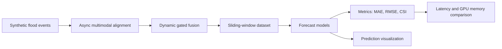

# Multimodal Flood Forecasting with Conv-LSTM and Strong Baselines

An end-to-end deep learning project for urban flood-risk forecasting from
asynchronous multimodal observations. It begins with a controlled synthetic
pipeline for meteorology, remote sensing, GIS risk, and crowdsourced reports,
and now adds an isolated physical-data benchmark on **LarNO UKEA** and
**UrbanFlood24**.

The historical single-horizon benchmark is led by a preserved **Conv-LSTM**
checkpoint. The external physical-data track now compares six architectures:

- **Conv-LSTM**
- **Conv-LSTM + Attention**
- **CNN-Temporal Transformer**
- **U-RNN Lite (adapted)**
- **FNO2D-History (adapted)**
- **SimVP Lite (adapted)**

The repository now contains three evidence tracks with separate schemas and
protocols: the preserved historical synthetic benchmark, the Batch 4
multi-horizon strong-baseline benchmark, and the new external physical-data
benchmark. They are reported separately and are not treated as directly
interchangeable scores.

For a detailed Chinese account of the complete development history, workload,
successful and unsuccessful experiments, quantitative results, and engineering
capabilities, see
[PROJECT_FULL_EVOLUTION_REPORT.md](PROJECT_FULL_EVOLUTION_REPORT.md).

For the new six-model, five-seed UKEA leaderboard and paired event analysis,
see [EXTERNAL_STRONG_BASELINE_LEADERBOARD.md](EXTERNAL_STRONG_BASELINE_LEADERBOARD.md).
For the earlier 42-run UKEA/UrbanFlood24 audit, complete tables, figure guide,
and limitations, see
[EXTERNAL_PHYSICAL_DATA_EXPERIMENTS.md](EXTERNAL_PHYSICAL_DATA_EXPERIMENTS.md).

## External Physical-Data Benchmark

The strict Batch 5 leaderboard uses LarNO UKEA at `8 m / 5 min`, 60 minutes of
past-only input, joint `5/15/30/60 min` forecasts, an event-disjoint split, and
five seeds. Learning rates are selected on validation events without computing
test metrics. The 30 formal runs use the same `234/52/312`
train/validation/test windows. Historical Conv-LSTM files and checkpoints are
unchanged.

| Model | MAE cm | RMSE cm | CSI | MAE gain vs persistence | CSI gain | Latency ms/sample | Peak inference CUDA MB |
|---|---:|---:|---:|---:|---:|---:|---:|
| **Conv-LSTM** | **1.883 +/- 0.062** | 7.373 | 0.7504 | **16.4%** | +6.2 pp | 1.63 | **23.4** |
| Conv-LSTM + Attention | 1.965 +/- 0.090 | 7.602 | 0.7413 | 12.8% | +5.3 pp | 1.66 | 35.9 |
| CNN-Temporal Transformer | 1.971 +/- 0.111 | **7.343** | 0.7566 | 12.5% | +6.8 pp | 3.84 | 199.4 |
| U-RNN Lite (adapted) | 2.033 +/- 0.079 | 7.945 | 0.7595 | 9.7% | +7.1 pp | 5.93 | 30.2 |
| **FNO2D-History (adapted)** | 1.889 +/- 0.073 | 7.363 | **0.7883** | 16.1% | **+10.0 pp** | **0.61** | 36.3 |
| SimVP Lite (adapted) | 1.986 +/- 0.085 | 7.897 | 0.7647 | 11.8% | +7.6 pp | 2.81 | 26.5 |

The result is a useful two-winner tradeoff rather than a forced universal
winner. Conv-LSTM retains the lowest mean MAE and lowest inference CUDA
allocation. FNO2D-History has statistically indistinguishable event-level MAE
(`+0.006 cm` versus Conv-LSTM; 95% CI `[-0.046, +0.067]`) while improving CSI
by `+0.0577` (95% CI `[+0.0409, +0.0714]`, paired event permutation
`p=0.00098`). It also gives the best boundary F1 (`0.9265`), lowest dry-cell
predicted depth (`0.777 cm`), and strongest 60-minute CSI (`0.6841`).


The qualitative sample below is selected by target change, not by any model's
error. It provides a common spatial view of the six seed-42 checkpoints at
`+60 min`; aggregate claims still come from all events and all five seeds.


See the [complete Batch 5 analysis](EXTERNAL_STRONG_BASELINE_LEADERBOARD.md),
[machine-generated benchmark report](results/external_leaderboard_v2/EXTERNAL_PHYSICAL_BENCHMARK.md),
and [validation-only learning-rate audit](results/external_leaderboard_v2/lr_selection/LEARNING_RATE_SELECTION.md).

The earlier UrbanFlood24 experiment remains a three-model, three-seed sparse
pilot across three locations. It is retained in
[EXTERNAL_PHYSICAL_DATA_EXPERIMENTS.md](EXTERNAL_PHYSICAL_DATA_EXPERIMENTS.md)
and is not mixed into the new six-model UKEA ranking. Upgrading UrbanFlood24 to
the same six-model, five-seed protocol is the next external-data milestone.

## Historical Synthetic Result Snapshot

All model rows are historical legacy-schema results using the same synthetic
fused dataset, split seed `44`, test events, and risk threshold `0.28`
`normalized_depth`. The threshold is not a physical value such as centimeters.

| Model | MAE | RMSE | CSI | F1 | FAR | Latency ms/sample | Peak CUDA MB |
|---|---:|---:|---:|---:|---:|---:|---:|
| Conv-LSTM | 0.0547 | 0.0715 | 0.9370 | 0.9675 | 0.0253 | 1.674 | 42.65 |
| Conv-LSTM + Attention | 0.0703 | 0.0911 | 0.8957 | 0.9450 | 0.0483 | 1.894 | 88.41 |
| CNN-Temporal Transformer | 0.0795 | 0.1001 | 0.8657 | 0.9280 | 0.1097 | 8.055 | 259.32 |

Compared with the best non-neural persistence baseline
`persistence_meteo`, Conv-LSTM improves CSI by `0.1400` and reduces MAE by
about `50.1%`.


## Model Advantage


The preserved Conv-LSTM wins on the key practical dimensions:

- Lowest regression error: best MAE and RMSE.
- Best risk-mask skill: highest CSI and F1.
- Lowest false alarm ratio among the three neural architectures.
- Fastest inference among the three neural architectures.
- Lowest measured peak CUDA memory in evaluation.

The added variants are useful ablations, but they do not beat the original
Conv-LSTM on this benchmark:

- Conv-LSTM + Attention adds temporal weighting, but increases memory and does
  not improve CSI.
- This particular CNN-Temporal Transformer configuration is slower and has a
  higher false-alarm ratio on this split. This result is not a general claim
  that Transformer models are inferior.

## Baseline Comparison


Conv-LSTM is not only better than the new experimental variants; it is also
substantially better than simple persistence-style methods such as
meteorology-only, fused-depth persistence, satellite proxy persistence, and
zero-depth prediction.

## Efficiency Tradeoff


This view shows why the preserved Conv-LSTM is the preferred deployment
candidate: it combines the highest CSI with the lowest inference latency.

## Threshold Robustness


Across thresholds from `0.26` to `0.36`, Conv-LSTM keeps a consistently high
CSI while maintaining a low false-alarm ratio.

## Training Dynamics


The training curves show that Conv-LSTM achieves stronger validation CSI than
the two added neural variants under the current training protocol.

## Normalized Scorecard


The normalized scorecard combines accuracy and efficiency dimensions:

- CSI: higher is better.
- MAE: lower is better.
- FAR: lower is better.
- Latency: lower is better.
- Memory: lower is better.

Conv-LSTM dominates this current model set.

## Pipeline



## P0 Reproducibility Audit

The original correctness-and-credibility checklist is now closed with a
machine-readable baseline audit. One command captures the Git state, runtime
environment, checkpoint configuration, event-disjoint split, metrics,
latency/memory protocol, checkpoint hash, and SHA-256 for every fused event.

```bash
python scripts/capture_baseline.py \
  --fused_dir runs/large60_h24_l1_seed42/data/fused \
  --checkpoint runs/large60_grid_h24_h32_l1/h32_l1_d0_seed44/outputs/checkpoints/best.pt \
  --output_dir artifacts/baseline \
  --batch_size 8 --threshold 0.28 --device auto --overwrite
```

The committed audit bundle reproduces the preserved Conv-LSTM at
`MAE=0.0547086373` and `CSI=0.9370353465`. Its checkpoint SHA-256 is
`388a5ebd...b598f`, and all 60 fused event hashes are captured in the data
manifest. See [P0_COMPLETION.md](P0_COMPLETION.md) for the requirement matrix,
artifact definitions, exact identities, and validity boundary.

## Trustworthiness And Rain Schema Upgrade

The first engineering-hardening batch is implemented with backward
compatibility:

- One `DepthScale` controls synthetic labels, model output, checkpoints,
  metrics, and visualization. New runs use `[0.0, 1.2] normalized_depth`.
- Risk thresholds are saved with unit and meaning metadata.
- Aligned satellite and GIS values no longer decay twice. `legacy` value decay
  remains available for reproducibility.
- Social reports now include local observation, count, confidence, and age
  maps, so a valid zero-depth report differs from no observation.
- Batch 1's 19-channel schema remains available as `batch1`. The current
  23-channel default adds causal current and accumulated rainfall while keeping
  `miss_gis`, `dt_gis`, all `q_*` fields, and the social observation mask.
- Training and validation use the same loss configuration and save each loss
  component.
- The realtime pipeline fails fast when an input selects a future timestamp.

Historical 13-channel checkpoints remain loadable. The preserved Conv-LSTM
checkpoint was re-evaluated through the compatibility path at threshold `0.28`
and reproduced `MAE=0.0547086`, `RMSE=0.0714920`, `CSI=0.9370353`, and
`F1=0.9674943`.

Rainfall features use only current and past values: `rain_current`, rolling
sums over 3/6/12 steps, recent 6-step maximum, and 3-step trend. New
checkpoints save the exact channel order, registry version, and rain-feature
version; evaluation rejects incompatible schemas before model inference.

## Rain Input Ablation


A controlled 20-event synthetic experiment compared the same Conv-LSTM budget
with A: legacy 13 channels, B: A plus current rain, and C: A plus current and
3/6/12-step accumulated rain.

| Variant | Channels | Parameters | MAE | RMSE | CSI | F1 | FAR |
|---|---:|---:|---:|---:|---:|---:|---:|
| A: legacy inputs | 13 | 13,177 | 0.1491 | 0.1771 | 0.6523 | 0.7895 | 0.3477 |
| B: + current rain | 14 | 13,285 | 0.1065 | 0.1414 | 0.6584 | 0.7940 | 0.3416 |
| C: + current and accumulated rain | 17 | 13,609 | 0.0776 | 0.0975 | 0.6914 | 0.8175 | 0.3083 |


Both rainfall variants improved CSI on all three held-out events in this small
controlled run. C reduced MAE by `48.0%` and increased CSI by `0.0391` versus
A while increasing parameters by `3.3%`. This is a single-seed, three-epoch diagnostic, not a replacement for the
60-event historical benchmark or a multi-seed formal result.

## Reproducible Experiment System

Batch 3 extends that diagnostic to paired seeds `42`, `44`, and `52`, all using
the same event split and three-epoch Conv-LSTM budget.

| Input variant | MAE mean +/- std | CSI mean +/- std |
|---|---:|---:|
| Legacy 13 channels | 0.1434 +/- 0.0132 | 0.6515 +/- 0.0013 |
| + current rain | 0.0969 +/- 0.0115 | 0.6799 +/- 0.0427 |
| + current and accumulated rain | **0.0824 +/- 0.0042** | **0.6885 +/- 0.0345** |


The accumulated-rain input cuts mean MAE by `42.5%` versus the legacy input.
Its paired per-event MAE improvement has a bootstrap 95% CI of
`[0.0191, 0.1112]`. The CSI improvement interval crosses zero, so the project
does not claim a statistically resolved CSI gain from this three-event test.


The lead-time diagnostic reports MAE, RMSE, CSI, FAR, and POD at
`1/3/6/12/24` steps using a common threshold. Performance falls sharply at
long horizons; lead `24` contains only three test samples and is explicitly a
stress test. Full settings, modality smoke results, and reproducibility notes
are in [BATCH3_EXPERIMENTS.md](BATCH3_EXPERIMENTS.md).

## Batch 4 Multi-Horizon Benchmark

Batch 4 uses 48 longer 72-step events, an event-disjoint `33/7/8` split, five
training seeds, the full 23-channel schema, and 296 test windows at every lead
`1/3/6/12/24`. It compares a single-frame U-Net, 3D CNN, ConvGRU, and a new
multi-horizon Conv-LSTM U-Net under the same data, split, seed set, three-epoch
budget, hidden width, threshold, and loss settings.

| Model | Parameters | MAE mean +/- std | RMSE mean +/- std | CSI mean +/- std | Latency ms/sample |
|---|---:|---:|---:|---:|---:|
| U-Net Single Frame | 27,605 | 0.0828 +/- 0.0020 | 0.1139 +/- 0.0048 | 0.8672 +/- 0.0099 | **0.1757** |
| **3D CNN** | 15,437 | **0.0817 +/- 0.0042** | **0.1115 +/- 0.0030** | **0.8779 +/- 0.0156** | 0.2516 |
| ConvGRU | **14,393** | 0.0836 +/- 0.0087 | 0.1119 +/- 0.0078 | 0.8693 +/- 0.0104 | 0.8617 |
| Multi-Horizon Conv-LSTM U-Net | 61,325 | 0.0891 +/- 0.0070 | 0.1224 +/- 0.0078 | 0.8583 +/- 0.0118 | 1.4073 |


The new Conv-LSTM U-Net does **not** beat the strong baselines in this first
controlled run. The 3D CNN is the Batch 4 accuracy winner, the U-Net is
fastest, and ConvGRU has the fewest parameters. This negative result is kept
because it is more useful than selecting only favorable runs. Protocol,
paired bootstrap intervals, efficiency results, reproduction commands, and
limitations are in [BATCH4_EXPERIMENTS.md](BATCH4_EXPERIMENTS.md).

## Data Design

Each synthetic event starts from a hidden ground-truth water-depth field
`gt_depth`. Different modalities observe this field with different frequency,
noise, delay, and missingness:

| Modality | Main Fields | Description |
|---|---|---|
| Meteorology | `meteo_depth` | High-frequency estimated water depth |
| Rainfall | `rain_current`, `rain_accum_3/6/12` | Causal current and rolling accumulated rainfall |
| Remote sensing | `sat_base` | Low-frequency satellite flood/wet-area proxy |
| GIS risk | `gis_risk` | Static background risk map |
| Social reports | `soc_depth`, `soc_observation_mask`, `soc_count_map` | Spatially aggregated crowdsourced reports and coverage |
| Fusion outputs | `fused_depth`, `risk_score` | Dynamic gated fusion outputs |
| Reliability metadata | `miss_*`, `dt_*`, `q_*`, `n_soc` | Missingness, age, quality, and report-count signals |
| Static maps | `exposure`, `drainage_capacity` | Urban exposure and drainage-capacity factors |

Model input and target:

```text
X: [batch, input_len, channels, height, width]
Y: [batch, 1, height, width]
```

Default configuration:

```text
input_len = 12
lead_time = 6
height = 64
width = 64
channels = 23 (current default), 19 (Batch 1), or 13 (legacy checkpoint compatibility)
```

## Repository Structure

```text
.
|-- run_all.py                         # End-to-end pipeline runner
|-- requirements.txt                   # Python dependencies
|-- requirements-dev.txt               # Test dependencies
|-- README.md                          # GitHub project homepage
|-- PROJECT.md                         # Concise project report
|-- PROJECT_FULL_EVOLUTION_REPORT.md  # Complete Chinese evolution and results report
|-- EXTERNAL_PHYSICAL_DATA_EXPERIMENTS.md # UrbanFlood24 and LarNO UKEA benchmark
|-- DATA_CARD.md                       # Synthetic data and field definitions
|-- LIMITATIONS.md                     # Valid-use boundaries
|-- CHANGELOG.md                       # Auditable engineering changes
|-- MODEL_COMPARISON_REPORT.md         # Generated model comparison report
|-- ARCHITECTURE_EXPERIMENTS.md        # Architecture experiment note
|-- BATCH4_EXPERIMENTS.md              # Five-seed multi-horizon benchmark
|-- P0_COMPLETION.md                   # Correctness and audit evidence map
|-- artifacts/baseline/                # Lightweight committed audit manifests
|-- docs/figures/                      # GitHub-ready showcase figures
|-- docs/experiments/external_physical_v1/ # Public external-result tables and manifests
|-- src/
|   |-- generate_synthetic.py          # Synthetic event generation
|   |-- align_modalities.py            # Async multimodal alignment
|   |-- fuse_dynamic_gate.py           # Dynamic gated fusion
|   |-- dataset.py                     # Sliding-window dataset
|   |-- data/schemas.py                # Depth and threshold metadata
|   |-- data/transforms.py             # Causal rainfall feature derivation
|   |-- data/validation.py             # Realtime causality checks
|   |-- training/losses.py             # Shared train/validation loss
|   |-- model.py                       # Original Conv-LSTM model
|   |-- train.py                       # Original Conv-LSTM training
|   |-- evaluate.py                    # Original checkpoint evaluation
|   |-- predict_visualize.py           # Prediction visualization
|   |-- compare_baselines.py           # Persistence baseline comparison
|   |-- model_variants.py              # Added neural architecture variants
|   |-- train_architecture.py          # Architecture-variant training
|   |-- evaluate_architecture.py       # Metrics, latency, and memory evaluation
|   |-- compare_architectures.py       # Three-model comparison runner
|   |-- run_input_ablation.py          # A/B/C rainfall input comparison
|   |-- run_multiseed.py               # Paired multi-seed aggregation and bootstrap CI
|   |-- run_lead_time.py               # 1/3/6/12/24-step evaluation runner
|   |-- batch4_dataset.py              # Joint multi-horizon target dataset
|   |-- batch4_models.py               # U-Net, 3D CNN, ConvGRU, Conv-LSTM U-Net
|   |-- train_batch4.py                # Shared Batch 4 training protocol
|   |-- evaluate_batch4.py             # Horizon/event metrics and efficiency
|   |-- run_batch4.py                  # Five-seed orchestration and bootstrap
|   |-- external_data.py               # Streaming UrbanFlood24/UKEA adapter
|   |-- external_models.py             # Isolated physical-data model copies
|   |-- train_external.py              # Physical multi-horizon training/evaluation
|   |-- run_external_benchmark.py      # Resumable multi-model, multi-seed runner
|   |-- summarize_external.py          # Tables, plots, and protocol checks
|   |-- visualize_external_predictions.py # Spatial forecast/error figures
|   |-- experiments/                   # Event splits and statistical summaries
|   `-- make_model_showcase.py         # Publication-ready figures and report
|-- scripts/capture_baseline.py        # Environment, metric, split, and hash audit
|-- tests/                             # Correctness and compatibility tests
|-- data/                              # Generated data, ignored by git
|-- outputs/                           # Default generated outputs, ignored by git
`-- runs/                              # Experiment artifacts, ignored by git
```

## Installation

Python 3.10 to 3.12 is recommended. Install a PyTorch build matching your CUDA
version if you want GPU acceleration.

```bash
conda create -n floodwatch python=3.10 -y
conda activate floodwatch
pip install -r requirements.txt
```

For development and tests:

```bash
pip install -r requirements-dev.txt
python -m pytest -q
```

## Quick Start

Small smoke test:

```bash
python run_all.py --num_events 6 --t 36 --h 32 --w 32 --epochs 2 --batch_size 2 --hidden 12
```

Standard demo:

```bash
python run_all.py --num_events 20 --t 72 --h 64 --w 64 --epochs 5 --batch_size 4 --hidden 24
```

## Step-by-Step Usage

Generate synthetic data:

```bash
python -m src.generate_synthetic --num_events 20 --t 72 --h 64 --w 64 --out_dir data/raw
```

Align asynchronous modalities:

```bash
python -m src.align_modalities --raw_dir data/raw --out_dir data/aligned --mode realtime
```

The corrected default uses `--value_decay_mode none`; use
`--value_decay_mode legacy` only to reproduce historical alignment behavior.

Fuse modalities:

```bash
python -m src.fuse_dynamic_gate --aligned_dir data/aligned --out_dir data/fused
```

Validate realtime causality:

```bash
python -m src.data.validation --raw_dir data/raw --aligned_dir data/aligned --fused_dir data/fused --mode realtime
```

Train the original Conv-LSTM:

```bash
python -m src.train --fused_dir data/fused --epochs 10 --batch_size 4 --hidden 24
```

Run the controlled rainfall input ablation:

```bash
python -m src.run_input_ablation \
  --fused_dir data/fused \
  --output_root runs/input_ablation \
  --epochs 3 \
  --seed 44 \
  --split_seed 44 \
  --threshold 0.28
```

Evaluate a checkpoint:

```bash
python -m src.evaluate --fused_dir data/fused --checkpoint outputs/checkpoints/best.pt
```

Visualize predictions:

```bash
python -m src.predict_visualize --fused_dir data/fused --checkpoint outputs/checkpoints/best.pt
```

## Architecture Comparison

Train and compare the three neural architectures:

```bash
python -m src.compare_architectures \
  --output_root runs/architecture_comparison \
  --epochs 8 \
  --batch_size 4 \
  --hidden 32 \
  --transformer_heads 4 \
  --transformer_layers 2 \
  --seed 44 \
  --threshold 0.28 \
  --device cuda \
  --no-progress
```

Rebuild only the model-comparison figures and markdown report:

```bash
python -m src.make_model_showcase
```

Run Batch 4 after preparing its longer event set:

```bash
python -m src.prepare_batch4_data --output_root runs/batch4_multihorizon/data
python -m src.run_batch4 \
  --fused_dir runs/batch4_multihorizon/data/fused \
  --output_root runs/batch4_multihorizon/experiments \
  --models unet_single_frame,cnn3d,convgru,convlstm_unet \
  --seeds 42,44,52,77,2026 --split_seed 44 \
  --input_channels full --input_len 12 --lead_times 1,3,6,12,24 \
  --epochs 3 --batch_size 8 --hidden 12 --threshold 0.28 --device auto
```

Run the resumable external physical-data benchmark after downloading UKEA:

```bash
python -m src.run_external_benchmark \
  --dataset larno_ukea \
  --larno_root ../external_datasets/larno_ukea_8m_5min \
  --output_root runs/external_physical/benchmark_v1 \
  --models convlstm,convlstm_attention,cnn_temporal_transformer \
  --seeds 42,44,52,77,2026 --split_seed 44 \
  --epochs 10 --batch_size 4 --hidden 16 \
  --max_train_samples_per_event 64 --max_eval_samples_per_event 0 \
  --lr 0.0003 --device auto --amp
```

The runner skips completed metrics by default and rebuilds the aggregate CSV,
JSON, Markdown, horizon, threshold, skill-gain, and efficiency outputs. Urban
locations use `--dataset urbanflood24 --location location1` (or `2/3`) and
`--urban_root ../urbanflood24`.

## GitHub Packaging

The repository intentionally ignores generated data, checkpoints, and run
outputs:

```text
data/
outputs/
runs/
*.npz
*.pt
*.pth
```

This keeps the GitHub repository source-focused. Large artifacts should be
published through GitHub Releases, Git LFS, Hugging Face Hub, or cloud storage
if needed.

## Limitations

The historical and Batch 4 results validate controlled synthetic pipelines.
The external benchmark adds physical-unit hydraulic simulation data, but not
field sensors or surveyed real-city inundation, so it still does not establish
operational forecasting performance. Historical `normalized_depth` is not a
physical water-depth unit, and the uncertainty band remains a heuristic rather
than a calibrated 95% interval. See [LIMITATIONS.md](LIMITATIONS.md) and
[DATA_CARD.md](DATA_CARD.md).

CSI and IoU are numerically identical for the current binary flood-mask
definition, so the main tables display CSI and treat IoU as an alias.
