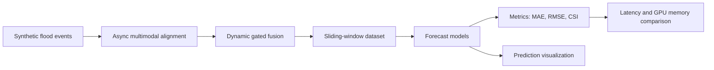

# Multimodal Flood Risk Forecasting with Conv-LSTM

这是一个面向个人项目展示和工程能力证明的多模态城市内涝风险预测 Demo。项目从合成洪涝事件数据出发，模拟气象、遥感、GIS、社交众包等异步多源观测，经过对齐、动态门控融合、时空预测、指标评估和可视化，形成一条完整的端到端实验链路。

当前主线模型是 **Conv-LSTM**。在保留原 Conv-LSTM 最佳结果的基础上，项目新增了两个扩展架构：

- **Conv-LSTM + Attention**
- **CNN-Temporal Transformer**

并统一比较了 **MAE、RMSE、CSI、推理延迟、CUDA 显存峰值** 等指标。

## Project Highlights

- 端到端闭环：数据生成 -> 异步对齐 -> 多模态融合 -> Conv-LSTM 预测 -> 评估 -> 可视化。
- 合成数据不是纯随机矩阵，而是先构造隐含真实水深场，再模拟不同数据源的频率、噪声、缺失和延迟。
- 支持气象、遥感、GIS、社交众包和元特征共 13 个输入通道。
- 保留并复现原 Conv-LSTM 最佳 checkpoint，不覆盖已有实验结果。
- 新增架构对比脚本，可一键训练并比较 Conv-LSTM、Conv-LSTM + Attention、CNN-Temporal Transformer。
- 输出结构化 JSON/CSV 指标和实验图表，适合写入简历、项目报告或 GitHub 展示页。

## Pipeline



## Repository Structure

```text
.
├── run_all.py                         # End-to-end pipeline runner
├── requirements.txt                   # Python dependencies
├── README.md                          # Unified GitHub project document
├── PROJECT.md                         # Historical project notes
├── ARCHITECTURE_EXPERIMENTS.md        # Architecture experiment note
├── src/
│   ├── generate_synthetic.py          # Synthetic flood event generation
│   ├── align_modalities.py            # Async multimodal alignment
│   ├── fuse_dynamic_gate.py           # Rule-based dynamic gated fusion
│   ├── dataset.py                     # Sliding-window dataset
│   ├── model.py                       # Original Conv-LSTM model
│   ├── train.py                       # Original Conv-LSTM training script
│   ├── evaluate.py                    # Original checkpoint evaluation
│   ├── predict_visualize.py           # Prediction visualization
│   ├── metrics.py                     # MAE/RMSE/CSI/F1/FAR metrics
│   ├── compare_baselines.py           # Persistence and simple baseline comparison
│   ├── ensemble_evaluate.py           # Multi-checkpoint ensemble evaluation
│   ├── run_experiment_grid.py         # Multi-seed/capacity grid runner
│   ├── model_variants.py              # Added architecture variants
│   ├── train_architecture.py          # Added architecture training
│   ├── evaluate_architecture.py       # Added latency/memory evaluation
│   └── compare_architectures.py       # Added architecture comparison runner
├── data/                              # Generated synthetic data, ignored by git
├── outputs/                           # Default generated outputs, ignored by git
└── runs/                              # Experiment artifacts, ignored by git
```

## Data Design

每个合成事件包含一个隐含真实水深场 `gt_depth`，不同模态以不同质量观测该真实状态：

| Modality | Main Fields | Description |
|---|---|---|
| Meteorology | `meteo_depth` | 高频连续气象估计，包含预报误差和平滑偏差 |
| Remote sensing | `sat_base` | 低频遥感积水/湿区概率图，存在时间间隔和缺失 |
| GIS risk | `gis_risk` | 静态或低频背景风险图，融合低洼度、不透水率、排水能力等 |
| Social reports | `soc_depth` | 稀疏众包上报，带延迟、噪声和置信度差异 |
| Fusion outputs | `fused_depth`, `risk_score` | 动态门控融合后的水深和风险特征 |
| Reliability meta | `miss_sat`, `miss_soc`, `dt_sat`, `dt_soc`, `n_soc` | 缺失、时间差、社交点数量等可靠性信号 |
| Static maps | `exposure`, `drainage_capacity` | 暴露度、排水能力等城市背景因子 |

模型输入为：

```text
X: [batch, input_len, channels, height, width]
Y: [batch, 1, height, width]
```

当前常用配置：

```text
input_len = 12
lead_time = 6
height = 64
width = 64
channels = 13
```

## Models

### 1. Conv-LSTM

原主线模型，使用卷积门控循环单元保留空间结构并建模时间演化：

```text
Input [B,T,C,H,W]
  -> Conv2d encoder
  -> ConvLSTMCell x num_layers
  -> Conv2d head
  -> depth prediction [B,1,H,W]
```

### 2. Conv-LSTM + Attention

在 Conv-LSTM 的所有时间步 hidden states 上加入逐像素时间注意力，让模型学习哪些历史时刻对当前预测更关键。

### 3. CNN-Temporal Transformer

先用 CNN 编码每一帧空间特征，再在每个像素位置上使用 Temporal Transformer 建模时间依赖，作为 Conv-LSTM 的替代时序建模尝试。

## Metrics

| Metric | Meaning |
|---|---|
| MAE | Mean Absolute Error for water-depth regression |
| RMSE | Root Mean Squared Error, more sensitive to large errors |
| CSI / IoU | Critical Success Index for binary flood-risk mask |
| Precision | Fraction of predicted risk cells that are true risk cells |
| Recall / POD | Fraction of true risk cells detected by the model |
| F1 | Harmonic mean of precision and recall |
| FAR | False Alarm Ratio |
| Latency | Average inference time per sample |
| Peak CUDA Memory | Peak allocated GPU memory during evaluation |

## Current Best Result

当前保留的最佳单模型 checkpoint：

```text
runs/large60_grid_h24_h32_l1/h32_l1_d0_seed44/outputs/checkpoints/best.pt
```

推荐阈值：

```text
threshold = 0.28
```

在 60 events 数据同一测试集上：

| Model | MAE | RMSE | CSI | F1 | FAR |
|---|---:|---:|---:|---:|---:|
| Conv-LSTM | 0.054709 | 0.071492 | 0.937035 | 0.967494 | 0.025316 |

## Architecture Comparison

在保留 Conv-LSTM checkpoint 的前提下，新架构结果独立保存到 `runs/architecture_comparison/`。

| Model | MAE | RMSE | CSI | Latency ms/sample | Peak CUDA MB |
|---|---:|---:|---:|---:|---:|
| Conv-LSTM | 0.054709 | 0.071492 | 0.937035 | 1.674 | 42.65 |
| Conv-LSTM + Attention | 0.070253 | 0.091082 | 0.895708 | 1.894 | 88.41 |
| CNN-Temporal Transformer | 0.079548 | 0.100123 | 0.865670 | 8.055 | 259.32 |

结论：当前测试划分下，原 Conv-LSTM 仍然是最优模型。新增模型作为结构扩展和消融尝试已完整保留，后续可以继续围绕学习率、层数、损失函数、threshold calibration 和多 seed 协议调优。

## Installation

建议使用 Python 3.10 到 3.12。GPU 环境建议安装与本机 CUDA 匹配的 PyTorch。

```bash
conda create -n floodwatch python=3.10 -y
conda activate floodwatch
pip install -r requirements.txt
```

## Quick Start

快速跑通小规模端到端流程：

```bash
python run_all.py --num_events 6 --t 36 --h 32 --w 32 --epochs 2 --batch_size 2 --hidden 12
```

标准 Demo：

```bash
python run_all.py --num_events 20 --t 72 --h 64 --w 64 --epochs 5 --batch_size 4 --hidden 24
```

## Step-by-Step Usage

生成合成数据：

```bash
python -m src.generate_synthetic --num_events 20 --t 72 --h 64 --w 64 --out_dir data/raw
```

异步对齐：

```bash
python -m src.align_modalities --raw_dir data/raw --out_dir data/aligned --mode realtime
```

动态门控融合：

```bash
python -m src.fuse_dynamic_gate --aligned_dir data/aligned --out_dir data/fused
```

训练原 Conv-LSTM：

```bash
python -m src.train --fused_dir data/fused --epochs 10 --batch_size 4 --hidden 24
```

评估原 Conv-LSTM：

```bash
python -m src.evaluate --fused_dir data/fused --checkpoint outputs/checkpoints/best.pt
```

预测可视化：

```bash
python -m src.predict_visualize --fused_dir data/fused --checkpoint outputs/checkpoints/best.pt
```

## Run Architecture Comparison

训练并比较新旧三种架构：

```bash
python -m src.compare_architectures \
  --output_root runs/architecture_comparison \
  --epochs 8 \
  --batch_size 4 \
  --hidden 32 \
  --transformer_heads 4 \
  --transformer_layers 2 \
  --seed 44 \
  --threshold 0.28 \
  --device cuda \
  --no-progress
```

如果已经有 checkpoint，只重新生成评估表和图：

```bash
python -m src.compare_architectures \
  --output_root runs/architecture_comparison \
  --skip_training \
  --batch_size 4 \
  --hidden 32 \
  --transformer_heads 4 \
  --transformer_layers 2 \
  --seed 44 \
  --threshold 0.28 \
  --device cuda \
  --no-progress
```

输出文件：

```text
runs/architecture_comparison/architecture_comparison.csv
runs/architecture_comparison/architecture_comparison.json
runs/architecture_comparison/figures/architecture_metrics.png
runs/architecture_comparison/figures/architecture_efficiency.png
runs/architecture_comparison/figures/architecture_training_curves.png
```

## GitHub Notes

本仓库的 `.gitignore` 默认排除了以下大文件和生成物：

- `data/`
- `outputs/`
- `runs/`
- `*.npz`
- `*.pt`
- `*.rar`
- Python cache files

这样可以把 GitHub 仓库保持为源码和文档仓库，避免误上传大数据、checkpoint 和实验缓存。若需要发布模型权重，建议使用 GitHub Releases、Hugging Face Hub、OneDrive 链接或 Git LFS。

## Project Summary

本项目重点不是单纯训练一个模型，而是完整模拟了多源灾害数据进入系统后如何形成风险预测结果：数据侧模拟多源异步观测，融合侧通过动态门控整合可靠性，模型侧通过 Conv-LSTM 和扩展架构进行空间-时间预测，评估侧同时考虑水深回归误差和风险区域识别质量。当前最佳 Conv-LSTM 在 60 events 测试集上达到 `CSI=0.9370`、`F1=0.9675`，明显优于多个 persistence baseline，说明多模态时空建模相比单源或持久性预测具有实质收益。
