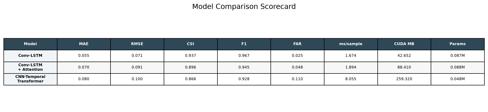
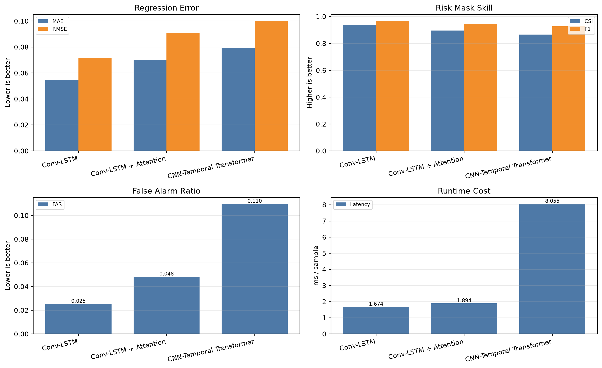
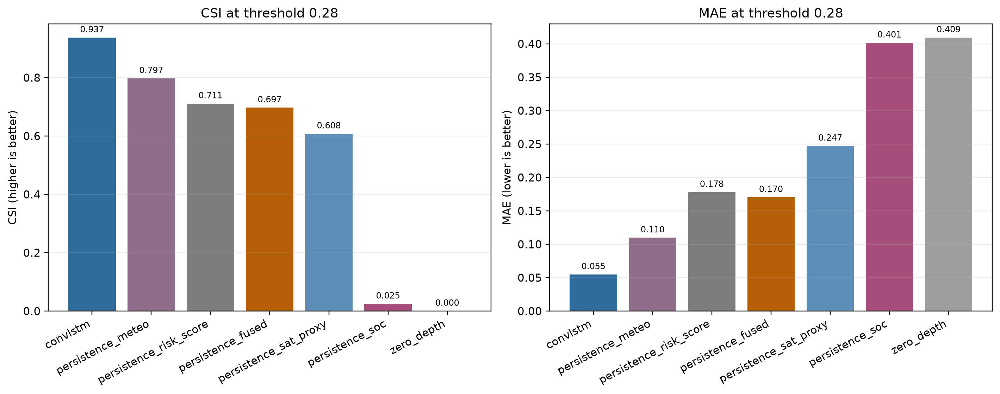
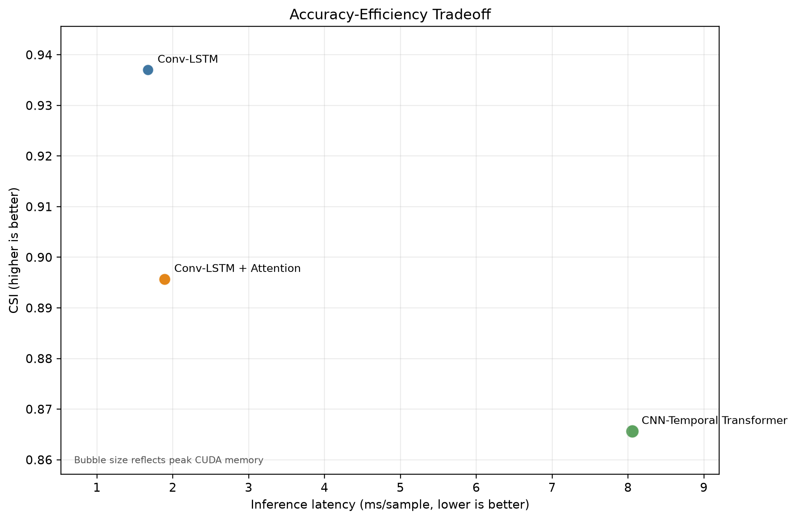
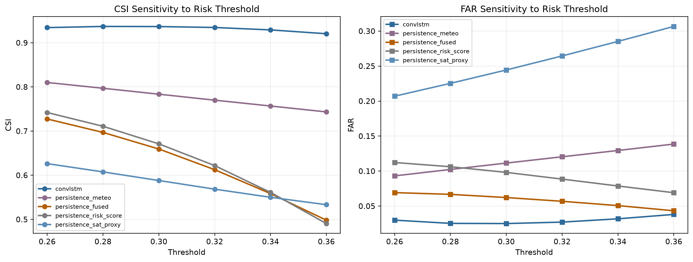
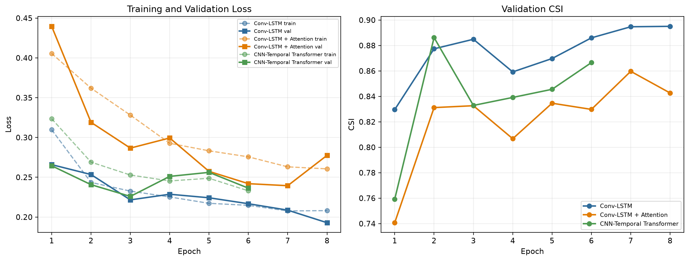
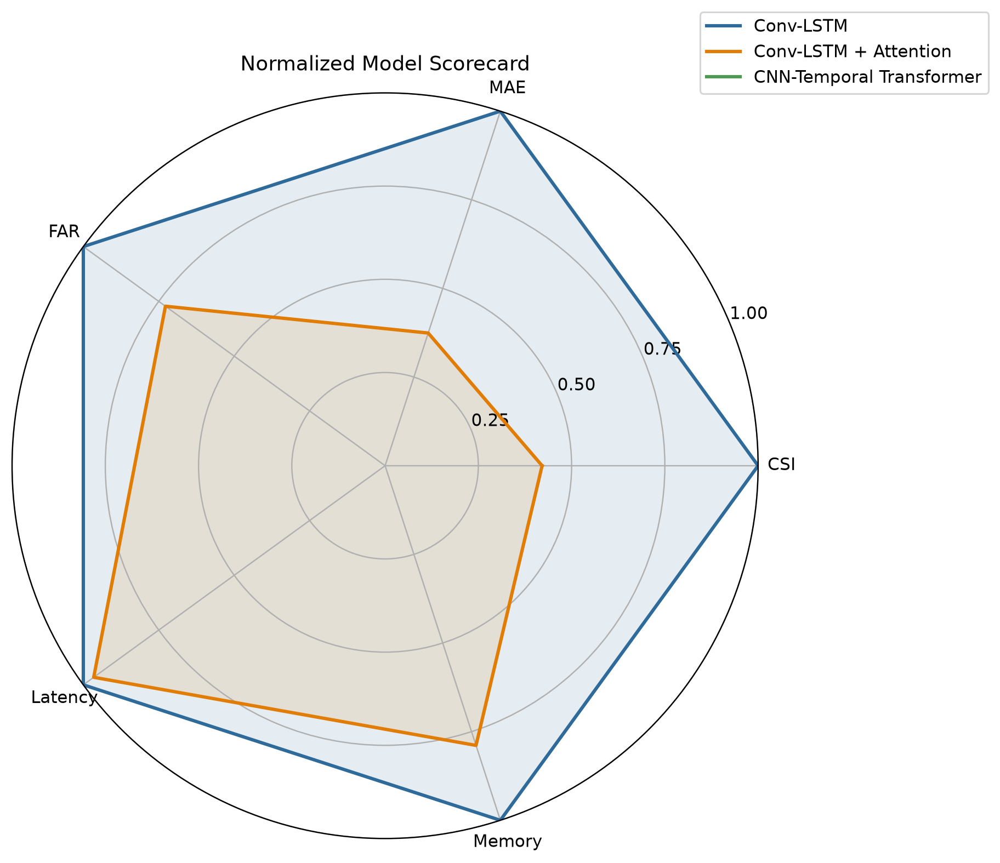
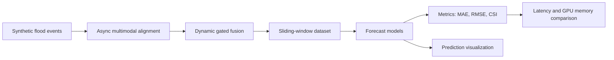
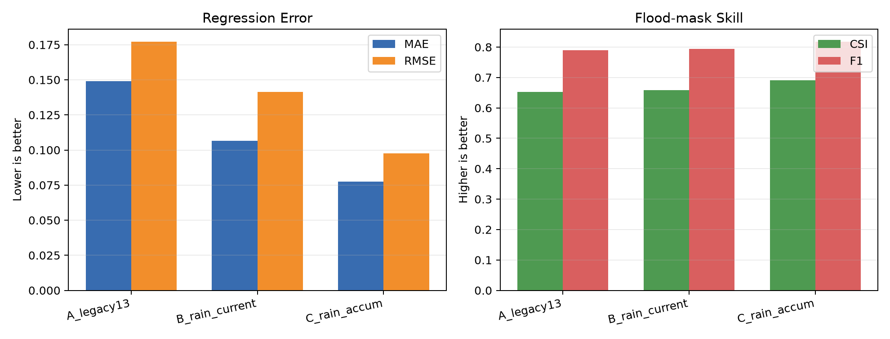
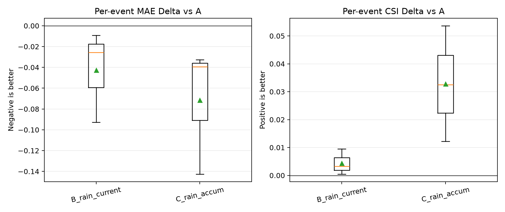

# Multimodal Flood Risk Forecasting with Conv-LSTM

An end-to-end deep learning demo for urban flood-risk forecasting from
asynchronous multimodal observations. The project simulates meteorology,
remote sensing, GIS risk, and crowdsourced reports, then aligns, fuses, models,
evaluates, and visualizes future water-depth risk maps.

The current best model is a preserved **Conv-LSTM** checkpoint. Two additional
architecture attempts are included for comparison:

- **Conv-LSTM + Attention**
- **CNN-Temporal Transformer**

The main takeaway is limited to this synthetic benchmark: on the current
60-event split, the original Conv-LSTM is the strongest of the tested models.

## Result Snapshot

All model rows are historical legacy-schema results using the same synthetic
fused dataset, split seed `44`, test events, and risk threshold `0.28`
`normalized_depth`. The threshold is not a physical value such as centimeters.

| Model | MAE | RMSE | CSI | F1 | FAR | Latency ms/sample | Peak CUDA MB |
|---|---:|---:|---:|---:|---:|---:|---:|
| Conv-LSTM | 0.0547 | 0.0715 | 0.9370 | 0.9675 | 0.0253 | 1.674 | 42.65 |
| Conv-LSTM + Attention | 0.0703 | 0.0911 | 0.8957 | 0.9450 | 0.0483 | 1.894 | 88.41 |
| CNN-Temporal Transformer | 0.0795 | 0.1001 | 0.8657 | 0.9280 | 0.1097 | 8.055 | 259.32 |

Compared with the best non-neural persistence baseline
`persistence_meteo`, Conv-LSTM improves CSI by `0.1400` and reduces MAE by
about `50.1%`.



## Model Advantage



The preserved Conv-LSTM wins on the key practical dimensions:

- Lowest regression error: best MAE and RMSE.
- Best risk-mask skill: highest CSI and F1.
- Lowest false alarm ratio among the three neural architectures.
- Fastest inference among the three neural architectures.
- Lowest measured peak CUDA memory in evaluation.

The added variants are useful ablations, but they do not beat the original
Conv-LSTM on this benchmark:

- Conv-LSTM + Attention adds temporal weighting, but increases memory and does
  not improve CSI.
- This particular CNN-Temporal Transformer configuration is slower and has a
  higher false-alarm ratio on this split. This result is not a general claim
  that Transformer models are inferior.

## Baseline Comparison



Conv-LSTM is not only better than the new experimental variants; it is also
substantially better than simple persistence-style methods such as
meteorology-only, fused-depth persistence, satellite proxy persistence, and
zero-depth prediction.

## Efficiency Tradeoff



This view shows why the preserved Conv-LSTM is the preferred deployment
candidate: it combines the highest CSI with the lowest inference latency.

## Threshold Robustness



Across thresholds from `0.26` to `0.36`, Conv-LSTM keeps a consistently high
CSI while maintaining a low false-alarm ratio.

## Training Dynamics



The training curves show that Conv-LSTM achieves stronger validation CSI than
the two added neural variants under the current training protocol.

## Normalized Scorecard



The normalized scorecard combines accuracy and efficiency dimensions:

- CSI: higher is better.
- MAE: lower is better.
- FAR: lower is better.
- Latency: lower is better.
- Memory: lower is better.

Conv-LSTM dominates this current model set.

## Pipeline



## Trustworthiness And Rain Schema Upgrade

The first engineering-hardening batch is implemented with backward
compatibility:

- One `DepthScale` controls synthetic labels, model output, checkpoints,
  metrics, and visualization. New runs use `[0.0, 1.2] normalized_depth`.
- Risk thresholds are saved with unit and meaning metadata.
- Aligned satellite and GIS values no longer decay twice. `legacy` value decay
  remains available for reproducibility.
- Social reports now include local observation, count, confidence, and age
  maps, so a valid zero-depth report differs from no observation.
- Batch 1's 19-channel schema remains available as `batch1`. The current
  23-channel default adds causal current and accumulated rainfall while keeping
  `miss_gis`, `dt_gis`, all `q_*` fields, and the social observation mask.
- Training and validation use the same loss configuration and save each loss
  component.
- The realtime pipeline fails fast when an input selects a future timestamp.

Historical 13-channel checkpoints remain loadable. The preserved Conv-LSTM
checkpoint was re-evaluated through the compatibility path at threshold `0.28`
and reproduced `MAE=0.0547086`, `RMSE=0.0714920`, `CSI=0.9370353`, and
`F1=0.9674943`.

Rainfall features use only current and past values: `rain_current`, rolling
sums over 3/6/12 steps, recent 6-step maximum, and 3-step trend. New
checkpoints save the exact channel order, registry version, and rain-feature
version; evaluation rejects incompatible schemas before model inference.

## Rain Input Ablation



A controlled 20-event synthetic experiment compared the same Conv-LSTM budget
with A: legacy 13 channels, B: A plus current rain, and C: A plus current and
3/6/12-step accumulated rain.

| Variant | Channels | Parameters | MAE | RMSE | CSI | F1 | FAR |
|---|---:|---:|---:|---:|---:|---:|---:|
| A: legacy inputs | 13 | 13,177 | 0.1491 | 0.1771 | 0.6523 | 0.7895 | 0.3477 |
| B: + current rain | 14 | 13,285 | 0.1065 | 0.1414 | 0.6584 | 0.7940 | 0.3416 |
| C: + current and accumulated rain | 17 | 13,609 | 0.0776 | 0.0975 | 0.6914 | 0.8175 | 0.3083 |



Both rainfall variants improved CSI on all three held-out events in this small
controlled run. C reduced MAE by `48.0%` and increased CSI by `0.0391` versus
A while increasing parameters by `3.3%`. This is a single-seed, three-epoch diagnostic, not a replacement for the
60-event historical benchmark or a multi-seed formal result.

## Data Design

Each synthetic event starts from a hidden ground-truth water-depth field
`gt_depth`. Different modalities observe this field with different frequency,
noise, delay, and missingness:

| Modality | Main Fields | Description |
|---|---|---|
| Meteorology | `meteo_depth` | High-frequency estimated water depth |
| Rainfall | `rain_current`, `rain_accum_3/6/12` | Causal current and rolling accumulated rainfall |
| Remote sensing | `sat_base` | Low-frequency satellite flood/wet-area proxy |
| GIS risk | `gis_risk` | Static background risk map |
| Social reports | `soc_depth`, `soc_observation_mask`, `soc_count_map` | Spatially aggregated crowdsourced reports and coverage |
| Fusion outputs | `fused_depth`, `risk_score` | Dynamic gated fusion outputs |
| Reliability metadata | `miss_*`, `dt_*`, `q_*`, `n_soc` | Missingness, age, quality, and report-count signals |
| Static maps | `exposure`, `drainage_capacity` | Urban exposure and drainage-capacity factors |

Model input and target:

```text
X: [batch, input_len, channels, height, width]
Y: [batch, 1, height, width]
```

Default configuration:

```text
input_len = 12
lead_time = 6
height = 64
width = 64
channels = 23 (current default), 19 (Batch 1), or 13 (legacy checkpoint compatibility)
```

## Repository Structure

```text
.
|-- run_all.py                         # End-to-end pipeline runner
|-- requirements.txt                   # Python dependencies
|-- requirements-dev.txt               # Test dependencies
|-- README.md                          # GitHub project homepage
|-- PROJECT.md                         # Concise project report
|-- DATA_CARD.md                       # Synthetic data and field definitions
|-- LIMITATIONS.md                     # Valid-use boundaries
|-- CHANGELOG.md                       # Auditable engineering changes
|-- MODEL_COMPARISON_REPORT.md         # Generated model comparison report
|-- ARCHITECTURE_EXPERIMENTS.md        # Architecture experiment note
|-- docs/figures/                      # GitHub-ready showcase figures
|-- src/
|   |-- generate_synthetic.py          # Synthetic event generation
|   |-- align_modalities.py            # Async multimodal alignment
|   |-- fuse_dynamic_gate.py           # Dynamic gated fusion
|   |-- dataset.py                     # Sliding-window dataset
|   |-- data/schemas.py                # Depth and threshold metadata
|   |-- data/transforms.py             # Causal rainfall feature derivation
|   |-- data/validation.py             # Realtime causality checks
|   |-- training/losses.py             # Shared train/validation loss
|   |-- model.py                       # Original Conv-LSTM model
|   |-- train.py                       # Original Conv-LSTM training
|   |-- evaluate.py                    # Original checkpoint evaluation
|   |-- predict_visualize.py           # Prediction visualization
|   |-- compare_baselines.py           # Persistence baseline comparison
|   |-- model_variants.py              # Added neural architecture variants
|   |-- train_architecture.py          # Architecture-variant training
|   |-- evaluate_architecture.py       # Metrics, latency, and memory evaluation
|   |-- compare_architectures.py       # Three-model comparison runner
|   |-- run_input_ablation.py          # A/B/C rainfall input comparison
|   `-- make_model_showcase.py         # Publication-ready figures and report
|-- tests/                             # Correctness and compatibility tests
|-- data/                              # Generated data, ignored by git
|-- outputs/                           # Default generated outputs, ignored by git
`-- runs/                              # Experiment artifacts, ignored by git
```

## Installation

Python 3.10 to 3.12 is recommended. Install a PyTorch build matching your CUDA
version if you want GPU acceleration.

```bash
conda create -n floodwatch python=3.10 -y
conda activate floodwatch
pip install -r requirements.txt
```

For development and tests:

```bash
pip install -r requirements-dev.txt
python -m pytest -q
```

## Quick Start

Small smoke test:

```bash
python run_all.py --num_events 6 --t 36 --h 32 --w 32 --epochs 2 --batch_size 2 --hidden 12
```

Standard demo:

```bash
python run_all.py --num_events 20 --t 72 --h 64 --w 64 --epochs 5 --batch_size 4 --hidden 24
```

## Step-by-Step Usage

Generate synthetic data:

```bash
python -m src.generate_synthetic --num_events 20 --t 72 --h 64 --w 64 --out_dir data/raw
```

Align asynchronous modalities:

```bash
python -m src.align_modalities --raw_dir data/raw --out_dir data/aligned --mode realtime
```

The corrected default uses `--value_decay_mode none`; use
`--value_decay_mode legacy` only to reproduce historical alignment behavior.

Fuse modalities:

```bash
python -m src.fuse_dynamic_gate --aligned_dir data/aligned --out_dir data/fused
```

Validate realtime causality:

```bash
python -m src.data.validation --raw_dir data/raw --aligned_dir data/aligned --fused_dir data/fused --mode realtime
```

Train the original Conv-LSTM:

```bash
python -m src.train --fused_dir data/fused --epochs 10 --batch_size 4 --hidden 24
```

Run the controlled rainfall input ablation:

```bash
python -m src.run_input_ablation \
  --fused_dir data/fused \
  --output_root runs/input_ablation \
  --epochs 3 \
  --seed 44 \
  --split_seed 44 \
  --threshold 0.28
```

Evaluate a checkpoint:

```bash
python -m src.evaluate --fused_dir data/fused --checkpoint outputs/checkpoints/best.pt
```

Visualize predictions:

```bash
python -m src.predict_visualize --fused_dir data/fused --checkpoint outputs/checkpoints/best.pt
```

## Architecture Comparison

Train and compare the three neural architectures:

```bash
python -m src.compare_architectures \
  --output_root runs/architecture_comparison \
  --epochs 8 \
  --batch_size 4 \
  --hidden 32 \
  --transformer_heads 4 \
  --transformer_layers 2 \
  --seed 44 \
  --threshold 0.28 \
  --device cuda \
  --no-progress
```

Rebuild only the model-comparison figures and markdown report:

```bash
python -m src.make_model_showcase
```

## GitHub Packaging

The repository intentionally ignores generated data, checkpoints, and run
outputs:

```text
data/
outputs/
runs/
*.npz
*.pt
*.pth
```

This keeps the GitHub repository source-focused. Large artifacts should be
published through GitHub Releases, Git LFS, Hugging Face Hub, or cloud storage
if needed.

## Limitations

The reported results validate an engineering pipeline on synthetic data. They
do not establish real-city forecasting performance. Normalized depth is not a
physical water-depth unit, the synthetic generator can make relationships more
regular than real observations, and the current uncertainty band is a
heuristic modality-disagreement band rather than a calibrated 95% confidence
interval. See [LIMITATIONS.md](LIMITATIONS.md) and [DATA_CARD.md](DATA_CARD.md).

CSI and IoU are numerically identical for the current binary flood-mask
definition, so the main tables display CSI and treat IoU as an alias.
