# External Physical-Data Benchmark

This report evaluates copied model variants on physical flood-simulation datasets. Existing Conv-LSTM source files and checkpoints are not modified.

## Protocol

- Common resolution: 8 m / 5 min
- Forecast horizons: 5, 15, 30, and 60 minutes
- Event-disjoint train/validation/test splits
- Past-only rainfall forcing: no future rainfall is exposed to any model
- Physical depth output in metres; MAE/RMSE reported in centimetres
- Flood skill at 0.10 m, plus threshold sensitivity at 0.05/0.10/0.20/0.30 m
- Wet-area RMSE, dry-cell predicted depth, one-pixel-tolerant boundary F1, and per-event robustness
- Persistence is evaluated on exactly the same test pixels
- U-RNN Lite, FNO2D-History, and SimVP Lite are explicitly labelled as adapted baselines, not exact paper reproductions
- Latency and peak CUDA allocation are inference-only measurements on the recorded GPU

## LarNO UKEA

- Run budget: 5 seeds, 12 epochs, batch size 4
- Samples per run: 234 train / 52 validation / 312 test
- Sampling caps per event: train=64, evaluation=0 (`0` means all available)
- Model width: 16 hidden channels
- Validation-selected learning rates: Conv-LSTM=1.0e-03, Conv-LSTM + Attention=3.0e-04, CNN-Temporal Transformer=1.0e-04, U-RNN Lite (adapted)=1.0e-04, FNO2D-History (adapted)=1.0e-03, SimVP Lite (adapted)=1.0e-04

| Model | Seeds | MAE (cm) | RMSE (cm) | CSI | MAE gain vs persistence | CSI gain | Latency (ms/sample) | Peak inference CUDA (MB) |
|---|---:|---:|---:|---:|---:|---:|---:|---:|
| Conv-LSTM | 5 | 1.883 +/- 0.062 | 7.373 +/- 0.116 | 0.7504 +/- 0.0078 | 16.4% | 6.2 pp | 1.63 | 23.4 |
| Conv-LSTM + Attention | 5 | 1.965 +/- 0.090 | 7.602 +/- 0.342 | 0.7413 +/- 0.0188 | 12.8% | 5.3 pp | 1.66 | 35.9 |
| CNN-Temporal Transformer | 5 | 1.971 +/- 0.111 | 7.343 +/- 0.246 | 0.7566 +/- 0.0123 | 12.5% | 6.8 pp | 3.84 | 199.4 |
| U-RNN Lite (adapted) | 5 | 2.033 +/- 0.079 | 7.945 +/- 0.116 | 0.7595 +/- 0.0115 | 9.7% | 7.1 pp | 5.93 | 30.2 |
| FNO2D-History (adapted) | 5 | 1.889 +/- 0.073 | 7.363 +/- 0.282 | 0.7883 +/- 0.0148 | 16.1% | 10.0 pp | 0.61 | 36.3 |
| SimVP Lite (adapted) | 5 | 1.986 +/- 0.085 | 7.897 +/- 0.353 | 0.7647 +/- 0.0109 | 11.8% | 7.6 pp | 2.81 | 26.5 |

| Model | Trainable parameters | Epochs run | Training time (s) |
|---|---:|---:|---:|
| Conv-LSTM | 22,084 | 6.6 +/- 0.8 | 14.26 +/- 1.65 |
| Conv-LSTM + Attention | 22,229 | 8.8 +/- 2.3 | 19.02 +/- 4.48 |
| CNN-Temporal Transformer | 9,412 | 9.0 +/- 1.9 | 31.01 +/- 6.21 |
| U-RNN Lite (adapted) | 412,644 | 7.4 +/- 1.7 | 43.62 +/- 9.75 |
| FNO2D-History (adapted) | 199,748 | 7.6 +/- 2.8 | 11.79 +/- 4.35 |
| SimVP Lite (adapted) | 111,940 | 6.2 +/- 0.7 | 22.07 +/- 2.24 |

| Model | Wet RMSE (cm) | Dry-cell depth (cm) | Boundary F1 | Peak-time error (min) | Event MAE gain median [IQR] |
|---|---:|---:|---:|---:|---:|
| Conv-LSTM | 22.457 | 0.857 | 0.9017 | 0.64 | 8.3% [0.5, 13.3] |
| Conv-LSTM + Attention | 23.102 | 0.931 | 0.8968 | 2.08 | 1.0% [-8.6, 11.6] |
| CNN-Temporal Transformer | 22.232 | 0.933 | 0.9035 | 3.14 | -6.1% [-18.9, 1.1] |
| U-RNN Lite (adapted) | 24.111 | 1.021 | 0.9094 | 0.10 | 10.1% [-11.2, 14.3] |
| FNO2D-History (adapted) | 22.441 | 0.777 | 0.9265 | 0.80 | 15.2% [5.1, 18.6] |
| SimVP Lite (adapted) | 24.055 | 0.973 | 0.9111 | 2.42 | 14.4% [1.4, 22.1] |

- Lowest average MAE: **Conv-LSTM** (1.883 cm).
- Highest average CSI: **FNO2D-History (adapted)** (0.7883).
- Best longest-horizon CSI: **FNO2D-History (adapted)** (0.6841 at 60 min).
- Strongest median event-level MAE gain: **FNO2D-History (adapted)** (15.2%, IQR 5.1% to 18.6%).
- Paired across events, FNO2D-History (adapted) minus Conv-LSTM: MAE delta +0.006 cm (95% bootstrap CI -0.046 to +0.067); CSI delta +0.0577 (95% CI +0.0409 to +0.0714).

## Figures

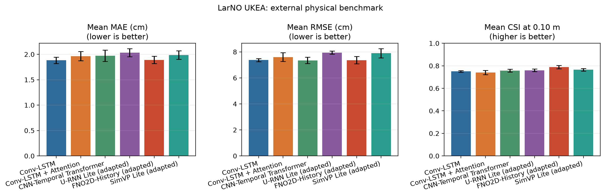

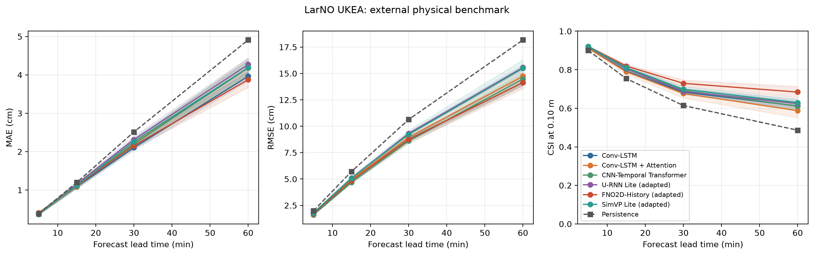

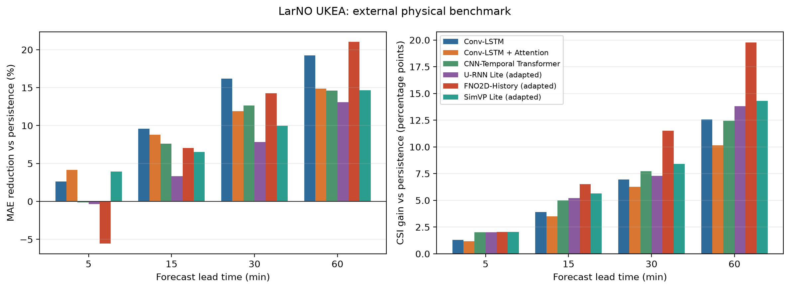

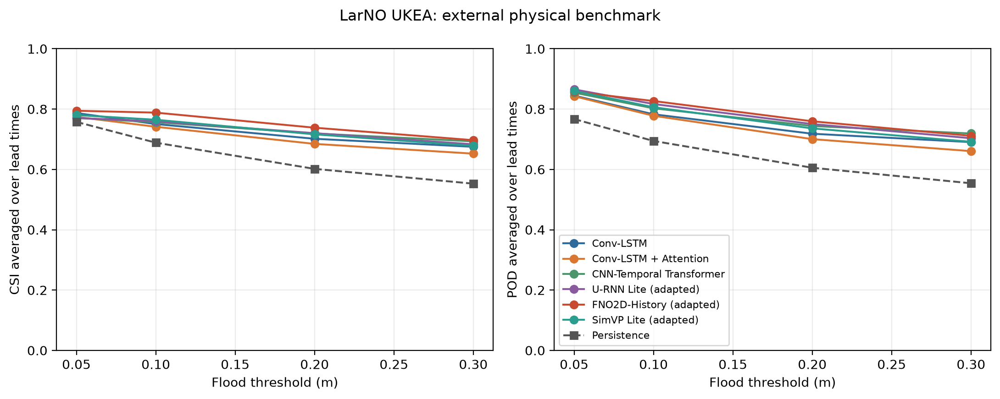

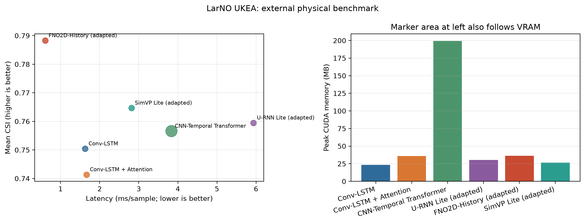

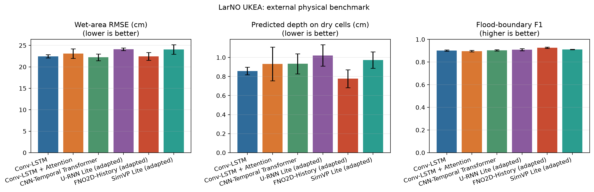

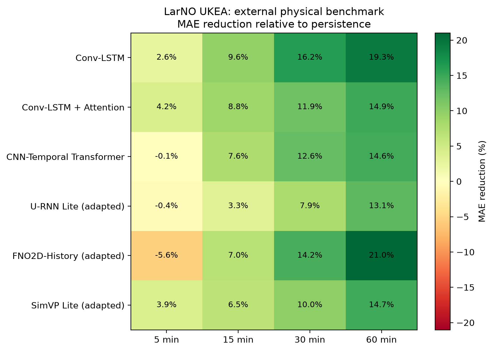

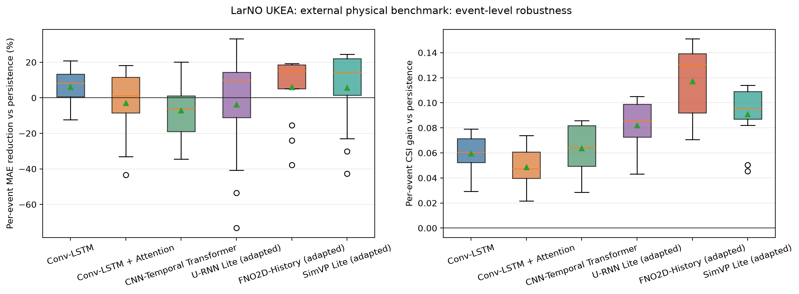

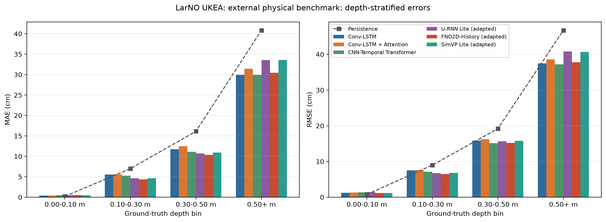

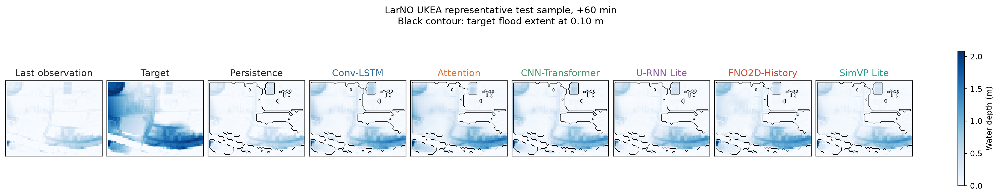

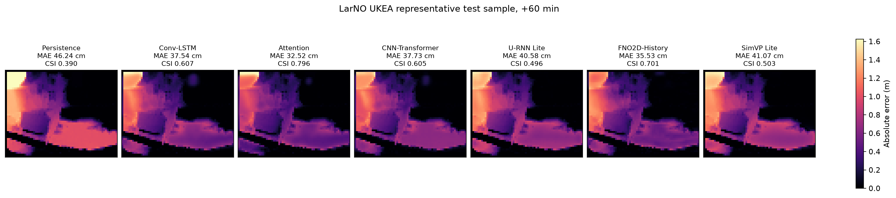

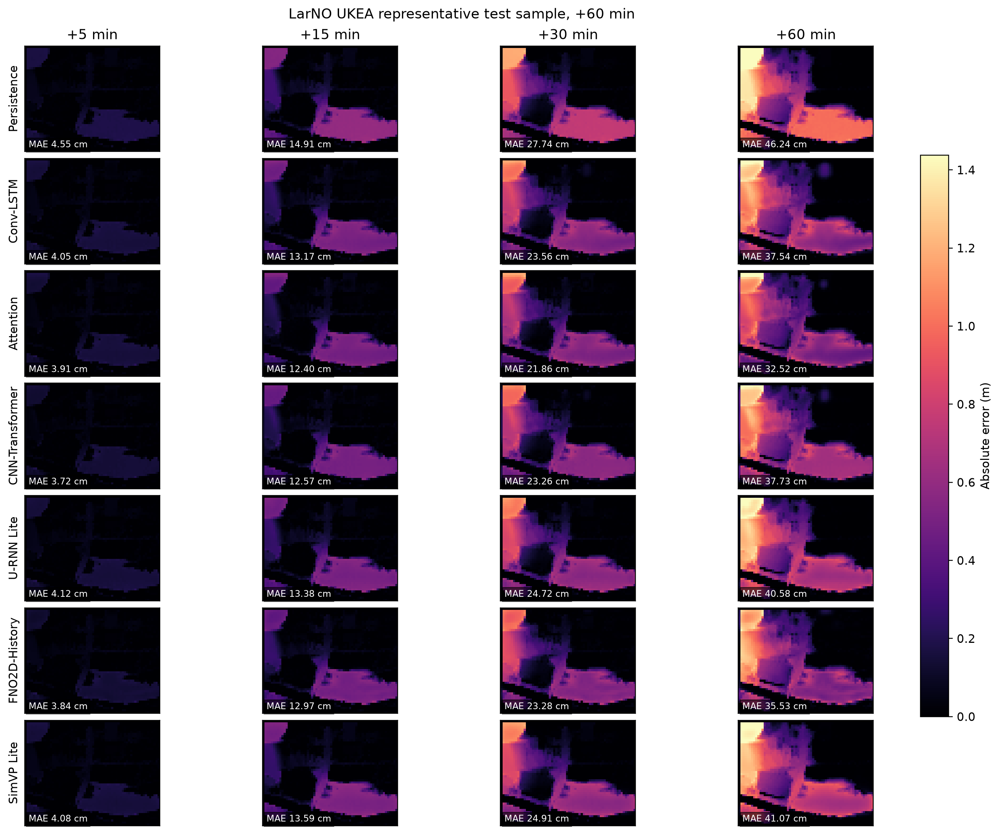

## Interpretation Rules

Positive MAE reduction and positive CSI gain mean the learned model beats persistence. Model-to-model claims should rely on multi-seed means, deviations, and event-level IQR rather than a single run. Latency and VRAM are device-specific and are intended for relative comparison on the recorded GPU.
