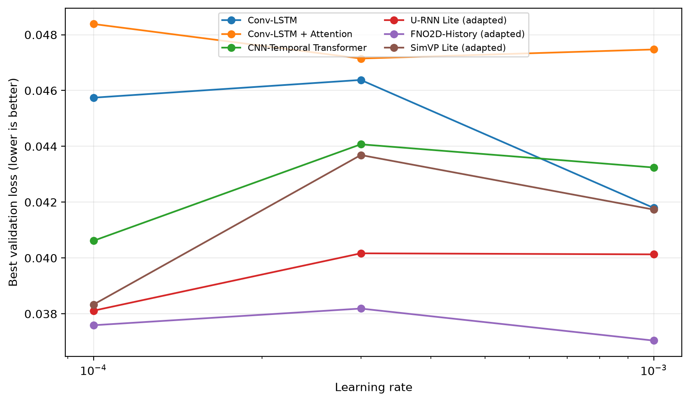

# External Baseline Learning-Rate Selection

Candidates are selected on the event-disjoint validation split. Test metrics are not computed during this stage.

| Model | Selected LR | Validation loss | Validation MAE (cm) | Validation CSI | Best epoch |
|---|---:|---:|---:|---:|---:|
| Conv-LSTM | 1.0e-03 | 0.04179 | 0.699 | 0.8016 | 3 |
| Conv-LSTM + Attention | 3.0e-04 | 0.04715 | 1.012 | 0.7423 | 7 |
| CNN-Temporal Transformer | 1.0e-04 | 0.04062 | 0.638 | 0.8080 | 5 |
| U-RNN Lite (adapted) | 1.0e-04 | 0.03811 | 0.716 | 0.8130 | 5 |
| FNO2D-History (adapted) | 1.0e-03 | 0.03704 | 0.778 | 0.8241 | 7 |
| SimVP Lite (adapted) | 1.0e-04 | 0.03833 | 0.630 | 0.8212 | 2 |

